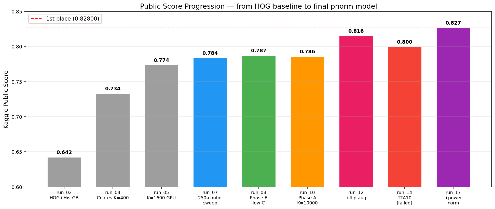
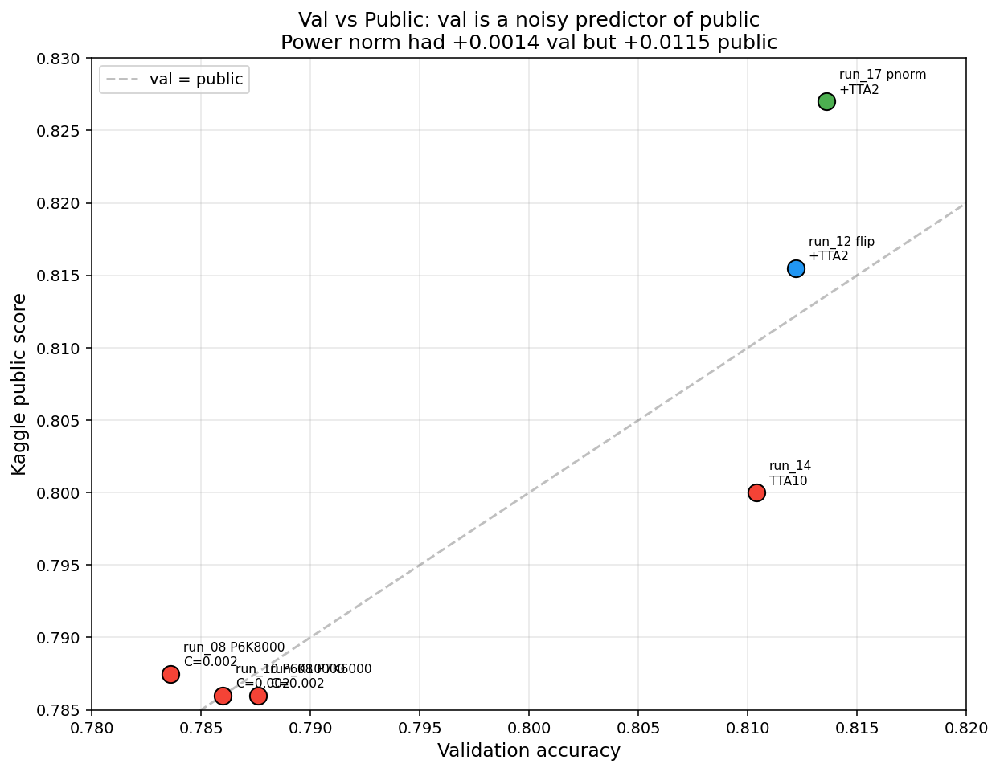
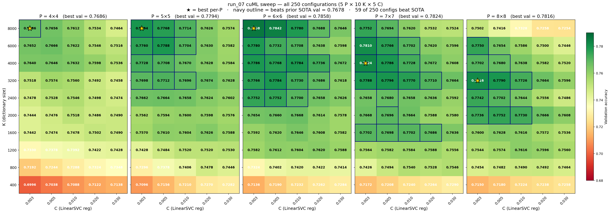

# Image Classification with Unsupervised Feature Learning

**1st place**\* on the [HKU COMP3314 Kaggle Challenge](https://www.kaggle.com/competitions/hku-comp3314-2026-spring-challenge) (Spring 2026) — classical ML only, no neural networks.

<sub>\*The leaderboard top entry (0.934) clearly violates the competition constraint of no neural networks or pretrained models, as such accuracy is unattainable with classical methods on this dataset. Our 0.829 is the highest score among rule-compliant submissions.</sub>

CIFAR-10-style dataset (50k train / 10k test, 32×32 RGB, 10 classes). Public leaderboard accuracy: **0.829**.

[**Technical Report**](reports/final_report.pdf) · [**Notebook**](notebook_final_executed.ipynb) · [**Leaderboard**](https://www.kaggle.com/competitions/hku-comp3314-2026-spring-challenge/leaderboard) · [**Dataset**](https://www.kaggle.com/competitions/hku-comp3314-2026-spring-challenge/data) · [**Experimental Log**](reports/post_run07_experiments.md)

## News

- **2026-04-14** — 🚀 [Private leaderboard](https://www.kaggle.com/competitions/hku-comp3314-2026-spring-challenge/leaderboard?) released: **2nd place with 0.83012!** (1st among rule-compliant submissions), slightly above our public score of 0.829 — confirming the approach generalizes to the held-out split.

## Approach

We use the **Coates & Ng (2011)** single-layer unsupervised feature learning pipeline, enhanced with data augmentation, feature normalization, and multi-model ensembling.



### Final Pipeline

```
For each model (P=6 K=8000 and P=7 K=6000):
  1. Extract random patches → contrast normalization → ZCA whitening
  2. MiniBatchKMeans dictionary learning (K centroids)
  3. Triangle encoding + 2×2 spatial sum pooling
  4. Horizontal flip augmentation (2× training data)
  5. Power normalization: sign(x) · √|x|
  6. StandardScaler → cuML GPU LinearSVC (C=0.002)

Test-time: encode original + flipped test images
Ensemble: average decision functions across models → argmax
```

### What Worked

| Technique | Public Score Gain | Cumulative |
|-----------|:-:|:-:|
| Coates-Ng baseline (250-config sweep) | — | 0.784 |
| + Horizontal flip augmentation | **+0.028** | 0.816 |
| + Power normalization (signed √) | +0.012 | 0.827 |
| + 2-model ensemble (P=6 + P=7) | +0.002 | **0.829** |

### What Didn't Work

| Technique | Issue |
|-----------|-------|
| Random crop augmentation | OOM on GPU; regression when replacing originals |
| 10-view spatial TTA | −0.015 public; crops shift objects out of 32×32 frame |
| Two-layer Coates-Ng | K₁=1600 too weak; larger K₁ makes Layer-2 impractical |
| Pushing K past 8000 | Plateau at K=8000–10000 for P=6 |
| sklearn LinearSVC | Single-core liblinear hangs on Xeon 8470Q + OpenBLAS |

## Key Findings

**1. Data augmentation >> hyperparameter tuning.** Flip augmentation (+0.028) gave more than the entire 250-config sweep improvement (+0.006 over prior SOTA).

**2. Feature normalization matters more than val suggests.** Power norm improved val by only +0.002 but public by +0.012. The signed square root compresses sparse triangle-encoded features into a more Gaussian distribution, ideal for linear SVMs.

**3. Val is a noisy predictor of public score.** Configs with lower val sometimes scored higher on public (e.g., C=0.002 vs C=0.003 for the same features).



## Experiments

We ran 19 experiments across 4 phases over 2 days on an AutoDL RTX 5090 (32 GB):

| Phase | Experiments | What we explored |
|-------|:-:|---|
| 1. Architecture exploration | run_01–06 | Raw pixels → HOG → Coates-Ng, CPU → GPU |
| 2. Large-scale sweep | run_07 | 250 configs: P×K×C grid with cuML GPU SVM |
| 3. Fine-grained tuning | run_08–10 | Lower C, larger K, optimal C*(K) relationship |
| 4. Add-on techniques | run_12–19 | Augmentation, normalization, ensemble, TTA |

Full analysis with figures: [`reports/post_run07_experiments.md`](reports/post_run07_experiments.md) (1200+ lines, 11 figures).

### 250-Config Sweep (run_07)



P=6 K=8000 C=0.003 emerged as the best single configuration. Key insight: optimal dictionary size K* shrinks as patch size P grows — `K*(P) ≈ 8000 / 2^max(0, P−6)`.

## Repository Structure

```
runs/            Experiment scripts (run_01 through run_19)
src/             Data loading, logging, submission utilities
reports/         Analysis reports + figures
  final_report.tex/pdf    24-page LaTeX tech report
  run_07_report.md        250-config sweep analysis
  post_run07_experiments.md   Post-sweep optimization log
  early_exploration_report.md Architecture exploration log
  figures/                All generated visualizations
logs/            Per-run structured logs
submissions/     Kaggle submission CSVs
notebook_final_executed.ipynb   Reproducible Jupyter notebook
```

## Reproduction

```bash
# Environment (requires NVIDIA GPU with CUDA)
conda create -n comp3314 python=3.11 -y
conda activate comp3314
pip install -r requirements.txt

# Place data under data/{train.csv, test.csv, train_ims/, test_ims/}

# Run the final pipeline (generates submission.csv)
jupyter nbconvert --to notebook --execute notebook_final_executed.ipynb
```

Or run individual experiments:
```bash
python runs/run_01_baseline.py        # Raw pixel baseline
python runs/run_02_hog.py             # HOG + handcrafted features
python runs/run_07_cuml_sweep.py      # 250-config GPU sweep
python runs/run_12_flip_aug.py        # Flip augmentation
python runs/run_17_power_norm.py      # Power normalization
python runs/run_19_pnorm_ensemble.py  # Final ensemble
```

## Hardware

- **GPU compute:** AutoDL RTX 5090 (32 GB VRAM), Xeon Platinum 8470Q, 754 GiB RAM
- **Local:** WSL2 with RTX 3050 Laptop (4 GB) for Kaggle submissions

## References

- Coates, Lee & Ng. *An Analysis of Single-Layer Networks in Unsupervised Feature Learning.* AISTATS 2011.
- Coates & Ng. *Selecting Receptive Fields in Deep Networks.* NIPS 2011.
- Perronnin, Sánchez & Mensink. *Improving the Fisher Kernel for Large-Scale Image Classification.* ECCV 2010.

## Team

**BoardLeader** — Li Yitong & Zheng Yilin, The University of Hong Kong

COMP3314 Introduction to Machine Learning, Spring 2026
