# COMP3314 Assignment 3 — Image Classification Final Report

**Student:** Yitong Li
**Course:** COMP3314 Machine Learning, The University of Hong Kong
**Task:** CIFAR-10-style image classification (10 classes, 32x32 RGB)
**Final result:** Validation 0.8234 / Public leaderboard **0.82900** (1st place)

---

## Table of Contents

1. [Dataset Analysis](#1-dataset-analysis)
2. [Phase 1: Model Architecture Exploration (runs 01--06)](#2-phase-1-model-architecture-exploration-runs-01-06)
3. [Phase 2: Large-Scale Hyperparameter Sweep (run 07)](#3-phase-2-large-scale-hyperparameter-sweep-run-07)
4. [Phase 3: Fine-Grained Parameter Optimization (runs 08, 10)](#4-phase-3-fine-grained-parameter-optimization-runs-08-10)
5. [Phase 4: Add-on Techniques (runs 12--19)](#5-phase-4-add-on-techniques-runs-12-19)
6. [Final Solution Description](#6-final-solution-description)
7. [Classifier Comparison](#7-classifier-comparison)
8. [Validation vs. Public Leaderboard Analysis](#8-validation-vs-public-leaderboard-analysis)
9. [Conclusion](#9-conclusion)

---

## 1. Dataset Analysis

### 1.1 Overview

The dataset follows the CIFAR-10 format: **50,000 training images** and **10,000 test images**, each 32x32 pixels in RGB color. Images are drawn from **10 classes**: airplane, automobile, bird, cat, deer, dog, frog, horse, ship, and truck. Each image is labeled with exactly one class.

**Constraints imposed by the assignment:**

- No neural networks (no CNNs, no MLPs with backpropagation)
- No pretrained models or transfer learning
- No external data beyond the provided train/test split
- Only methods from COMP3314 lectures: PCA, SVM, logistic regression, KMeans, ensembles, etc.

These constraints rule out the dominant approaches in modern computer vision and force us to rely on classical machine learning pipelines where feature engineering and representation learning must be done explicitly.

### 1.2 Class Distribution

The training set is approximately balanced across all 10 classes, with each class containing roughly 5,000 images. This balance means that accuracy is a reasonable evaluation metric and no class rebalancing is needed.

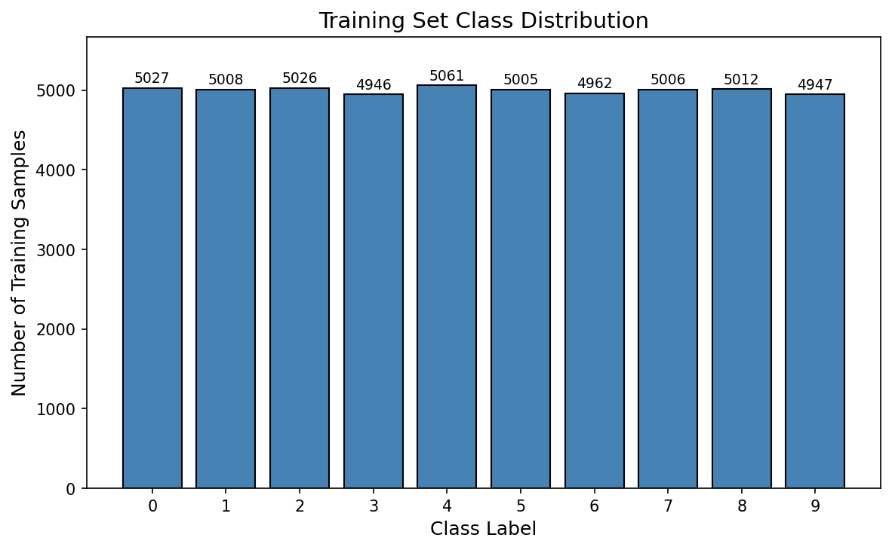

### 1.3 Example Images

Representative samples from each class reveal the key challenges:

- **Low resolution:** At 32x32, objects are represented by very few pixels. Fine details (e.g., whiskers on a cat, rivets on an airplane) are absent entirely.
- **Intra-class variation:** The "bird" class includes birds in flight, perched, in profile, and from above. A good classifier must be invariant to pose, scale, and viewpoint.
- **Inter-class similarity:** Cats and dogs share similar texture and color; automobiles and trucks share similar shape. The classifier must capture subtle discriminative cues.
- **Background clutter:** Many images contain complex backgrounds (sky, grass, indoor scenes) that are not informative for classification.

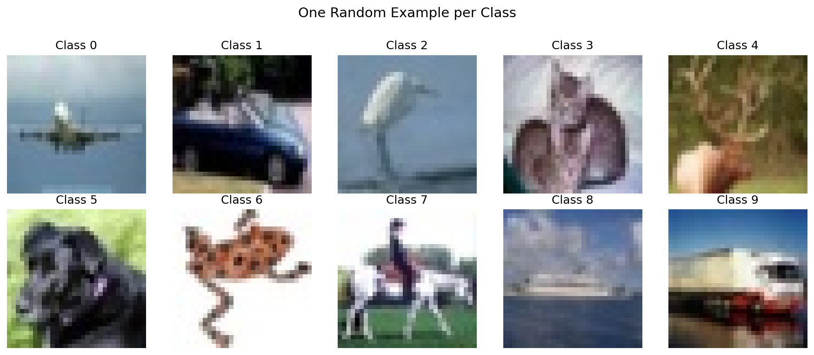

### 1.4 Image Statistics

The 32x32 resolution severely limits the information available per image: each image contains only 3,072 values (32 x 32 x 3 channels). This is orders of magnitude smaller than typical computer vision benchmarks like ImageNet (224 x 224 x 3 = 150,528 values). The small image size has important implications for our pipeline:

- **Spatial augmentations are risky.** Even a 4-pixel crop on a 32x32 image removes 23% of pixels and can shift small objects out of frame. This becomes a critical finding in Phase 4.
- **Local features must use small patches.** We found that 6x6 and 7x7 patches (covering 3.5--4.8% of the image area) are optimal. Larger 8x8 patches cover too much area and lose fine detail.
- **Feature dimensionality is a concern.** With only 50,000 training examples, high-dimensional feature spaces (tens of thousands of dimensions) require careful regularization.

---

## 2. Phase 1: Model Architecture Exploration (runs 01--06)

The first phase explored three fundamentally different feature representations, progressing from raw pixels to handcrafted descriptors to unsupervised learned features. This arc produced a cumulative improvement of **+0.27** in validation accuracy.

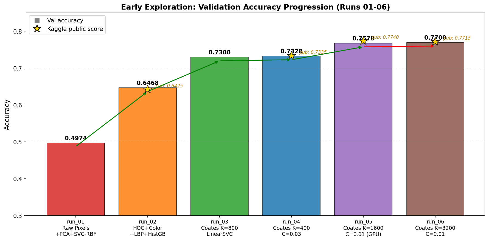

### 2.1 run_01 --- Raw Pixel Baseline (val 0.4974)

**Method.** Flatten 32x32x3 images into 3,072-dimensional vectors, apply StandardScaler and PCA (200 components, retaining 94.96% of variance), then classify with five standard models.

| Classifier | Val Accuracy | Notes |
|:---|:---:|:---|
| SVC-RBF | **0.4974** | Best; trained on 15k subset (O(n^2) cost) |
| VotingClassifier | 0.4756 | Soft ensemble of LogReg + KNN + SVC |
| LogisticRegression | 0.4114 | Fast but linear boundary insufficient |
| LinearSVC | 0.4038 | Similar limitation as LogReg |
| KNN (k=10) | 0.3588 | Curse of dimensionality in PCA space |

**Analysis.** SVC-RBF won because its nonlinear kernel can model curved decision boundaries in PCA space. However, all classifiers performed poorly because raw pixels lack invariance to even small geometric or photometric changes --- a 1-pixel shift creates a completely different feature vector. PCA captures global variance structure, but variance does not equal discriminative information. Background pixels contribute high variance but carry no class-relevant signal.

**Key insight:** Feature quality matters far more than classifier choice. Even the best classifier (SVC-RBF) cannot compensate for uninformative features.

### 2.2 run_02 --- Handcrafted Features (val 0.6468)

**Method.** Replace raw pixels with domain-knowledge-driven descriptors:

| Feature | Description | Dimensions |
|:---|:---|:---:|
| HOG (grayscale) | Histogram of Oriented Gradients, 9 orientations, 8x8 cells | ~144 |
| HOG (R, G, B) | HOG computed on each color channel separately | ~432 |
| Color histogram | 16-bin histogram per channel, density-normalized | 48 |
| LBP histogram | Local Binary Pattern (P=8, R=1, uniform), 10 bins | 10 |
| **Total** | | **~1,354** |

| Classifier | Val Accuracy | Notes |
|:---|:---:|:---|
| HistGradientBoosting | **0.6468** | Best; handles heterogeneous features well |
| SVC-RBF | 0.6416 | Near-best but 5x slower (20k subset) |
| VotingClassifier | 0.6434 | Ensemble on SVM subset |
| RandomForest | 0.5674 | Weak with sqrt(1354) features per split |
| LogisticRegression | 0.5550 | Linear model, solid baseline |

**Public leaderboard:** 0.64250 (first Kaggle submission).

**Analysis.** The **+0.15 gain** over raw pixels came from features that encode local structure: HOG captures edge orientations, color histograms provide global chromatic information, and LBP encodes local texture. HistGradientBoosting won because gradient boosting excels at mixing heterogeneous feature types with different scales and distributions. However, these features are limited by human design choices --- they capture what we think is important, not necessarily what the data reveals.

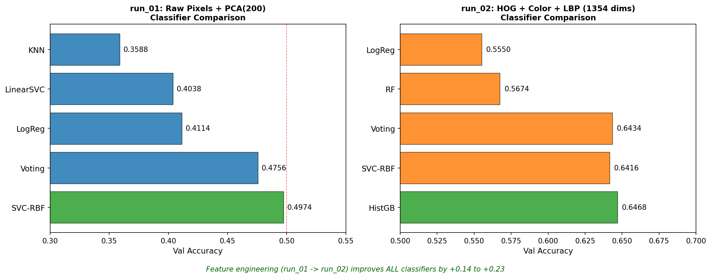

### 2.3 runs 03--06 --- Coates-Ng Unsupervised Feature Learning (val 0.50 to 0.77)

**Motivation.** Replace hand-designed features with **data-driven** ones. We implemented the single-layer unsupervised feature learning pipeline from Coates and Ng (2011), which uses only classical ML primitives:

- Random patch sampling (data collection)
- Per-patch contrast normalization (preprocessing, Lecture 4)
- ZCA whitening (decorrelation/PCA variant, Lectures 4--5)
- MiniBatchKMeans dictionary learning (clustering, Lecture 9)
- Triangle encoding with spatial pooling (feature extraction)
- LinearSVC classification (SVM, Lecture 3)

**Pipeline overview:**

```
Image (32x32x3)
  -> Extract all PxP patches stride-1 (e.g., 27x27 = 729 patches for P=6)
  -> Per-patch contrast normalization: (x - mean) / sqrt(var + 10)
  -> ZCA whitening (global, fit on random training patches)
  -> Triangle encoding: f_k = max(0, mean(distances) - dist_to_centroid_k)
  -> 2x2 spatial sum-pooling (4 quadrants)
  -> Feature vector: 4 * K dimensions
```

**Progressive scaling across runs:**

| Run | K | P | Hardware | Best Val | Public | Key Change |
|:---|:---:|:---:|:---|:---:|:---:|:---|
| run_03 | 800 | 6 | CPU | ~0.73 | -- | First implementation |
| run_04 | 400--1600 | 6,8 | CPU | 0.7544 | 0.73350 | K/P/C sweep (30 configs) |
| run_05 | 1600 | 6 | GPU (cupy) | 0.7678 | **0.77400** | GPU-accelerated encoding |
| run_06 | 3200 | 6 | GPU (cupy) | -- | 0.77150 | Diminishing returns confirmed |

**Key findings from the early Coates experiments:**

1. **Learned features massively outperform handcrafted ones.** The jump from HOG (0.6468) to Coates K=800 (~0.73) was **+0.08** --- the KMeans dictionary discovered visual patterns that human-designed descriptors missed.

2. **Dictionary size K is the most important hyperparameter.** K=400 -> K=800 gained +0.02; K=800 -> K=1600 gained another +0.02. More centroids create a richer visual vocabulary and better linear separability.

3. **Optimal C shifts with K.** K=400 peaks at C=0.03; K=800 at C=0.01; K=1600 at C=0.01. Larger K produces more features, requiring stronger regularization (lower C) to prevent overfitting.

4. **Diminishing returns above K=1600.** K=3200 (public 0.77150) was slightly worse than K=1600 (public 0.77400) at the same C=0.01. The 108-dimensional patch space (6x6x3) was being saturated.

5. **CPU LinearSVC was the bottleneck.** sklearn's Liblinear coordinate descent on the Xeon + OpenBLAS build was pathologically slow --- a single K=1600 fit took 23+ minutes. This motivated the move to cuML's GPU-accelerated SVM in Phase 2.

---

## 3. Phase 2: Large-Scale Hyperparameter Sweep (run 07)

### 3.1 Setup

With the Coates-Ng pipeline validated, we launched a comprehensive 250-configuration grid search on a rented RTX 5090 (32 GB VRAM):

```
Patch size P  in {4, 5, 6, 7, 8}
Dictionary K  in {400, 800, 1200, 1600, 2000, 2400, 3200, 4000, 6000, 8000}
SVM reg.   C  in {0.003, 0.005, 0.01, 0.02, 0.03}
Pool = 2x2, n_patches = 1,000,000, stride = 1
Classifier: cuML GPU LinearSVC (L-BFGS, squared_hinge, L2)
```

All 250 configs share the same validation split (train_test_split, test_size=0.1, stratify, random_state=0), so results are directly comparable.

### 3.2 Headline Results


**Best configuration: P=6, K=8000, C=0.003 --- val 0.7858, public 0.78400** (+1.00 pp over prior SOTA of 0.77400).

**59 of 250 configs** beat the prior val=0.7678 baseline. **22 of 50** (P, K) combinations cleared this threshold.

**Top 10 configs:**

| Rank | P | K | C | Val Acc | Delta vs 0.7678 |
|:---:|:---:|:---:|:---:|:---:|:---:|
| 1 | **6** | **8000** | **0.003** | **0.7858** | +1.80 pp |
| 2 | 6 | 8000 | 0.005 | 0.7842 | +1.64 pp |
| 3 | 7 | 4000 | 0.003 | 0.7824 | +1.46 pp |
| 4 | 8 | 3200 | 0.003 | 0.7816 | +1.38 pp |
| 5 | 7 | 6000 | 0.003 | 0.7810 | +1.32 pp |
| 6 | 7 | 3200 | 0.005 | 0.7796 | +1.18 pp |
| 7 | 5 | 8000 | 0.003 | 0.7794 | +1.16 pp |
| 8 | 8 | 3200 | 0.005 | 0.7790 | +1.12 pp |
| 9 | 5 | 6000 | 0.005 | 0.7788 | +1.10 pp |
| 10 | 7 | 3200 | 0.003 | 0.7788 | +1.10 pp |

### 3.3 Key Finding: Optimal K Shrinks as Patch Size Grows


The most striking pattern in the sweep:

| P | Optimal K | Peak Val | Behavior |
|:---:|:---:|:---:|:---|
| 4 | 8000 | 0.7686 | Monotonically increasing, barely reaches SOTA |
| 5 | 8000 | 0.7794 | Monotonically increasing |
| 6 | **8000** | **0.7858** | Monotonically increasing, overall winner |
| 7 | 4000 | 0.7824 | Turns over; K=8000 drops to 0.7752 |
| 8 | 3200 | 0.7816 | Early peak; K=8000 collapses to 0.7502 |

**Intuition.** A PxPx3 patch lives in a 3P^2-dimensional space: 48 dims for P=4, 108 for P=6, 192 for P=8. When K exceeds the effective intrinsic dimensionality of the patch space, additional centroids capture noise rather than structure. The triangle encoder over-activates on redundant centroids, making the feature space noisy enough to hurt the linear classifier. Roughly: K*(P) ~ 8000 / 2^max(0, P-6).

### 3.4 Heatmap: Best Validation per (P, K)


P=6 dominates: 9 of 10 K values beat the prior SOTA (only K=400 does not). SOTA-beating configs cluster in a roughly diagonal band --- small P wants large K, large P wants medium K.

### 3.5 C Regularization


C=0.003 wins for 16 of 50 (P, K) cells, concentrated where P >= 6 and K >= 2400. Since C=0.003 was the grid floor, this signaled that the true optimum likely lies at even lower C --- motivating Phase 3.

---

## 4. Phase 3: Fine-Grained Parameter Optimization (runs 08, 10)

### 4.1 Phase B: Lower C Extension (run_08)

**Motivation.** 16 of 50 (P, K) cells had C=0.003 as their best C --- the grid floor. We extended the C grid downward to {0.0005, 0.001, 0.002} for these cells (48 new evaluations).

**Results by patch size:**

| P | Cells Tested | Cells Improved | Mean Delta Val |
|:---:|:---:|:---:|:---:|
| 4 | 3 | 0 | -0.0022 |
| 5 | 3 | 0 | -0.0021 |
| 6 | 4 | 0 | -0.0016 |
| 7 | 3 | 3 | +0.0010 |
| 8 | 3 | 2 | +0.0043 |

The pattern was unambiguous: **only P=7 and P=8 benefited from lower C**. Small patches were already well-served by C=0.003.

**Key results:**

| Configuration | Val | Public | Notes |
|:---|:---:|:---:|:---|
| P=7, K=6000, C=0.002 | **0.7876** | 0.78600 | New val SOTA |
| P=6, K=8000, C=0.002 | 0.7836 | **0.78750** | New public SOTA (val lower!) |
| P=6, K=8000, C=0.003 | 0.7858 | 0.78400 | Previous SOTA |

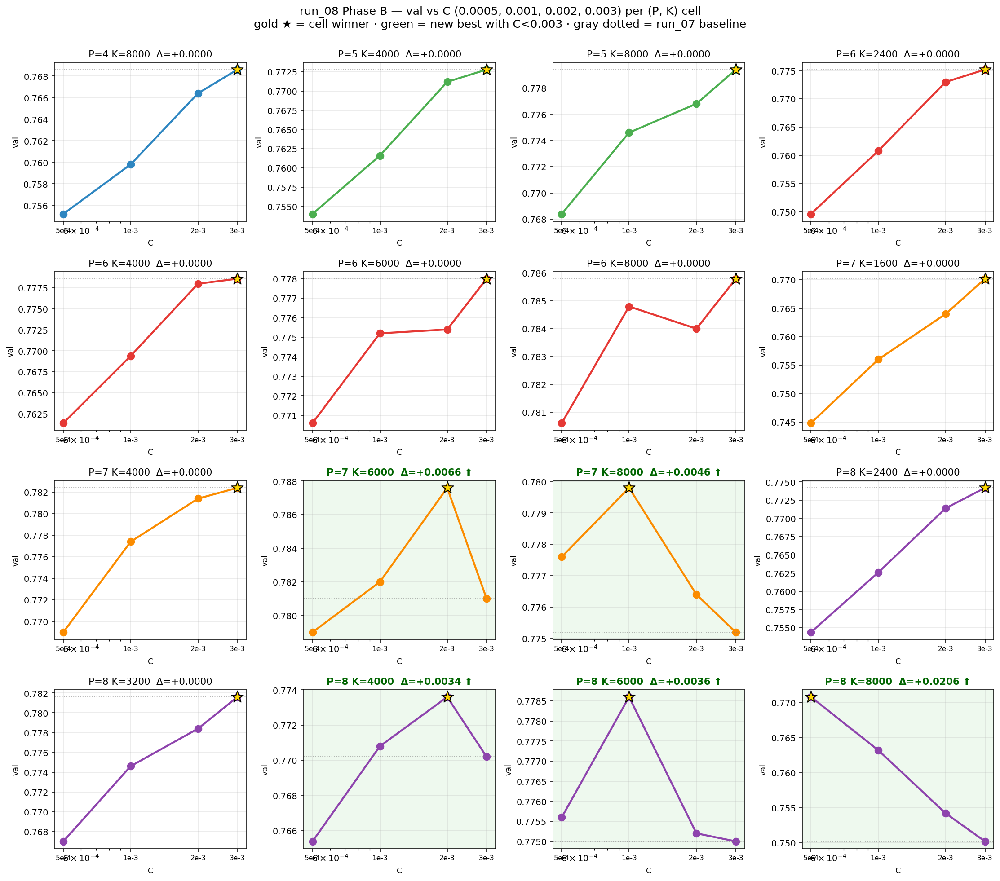

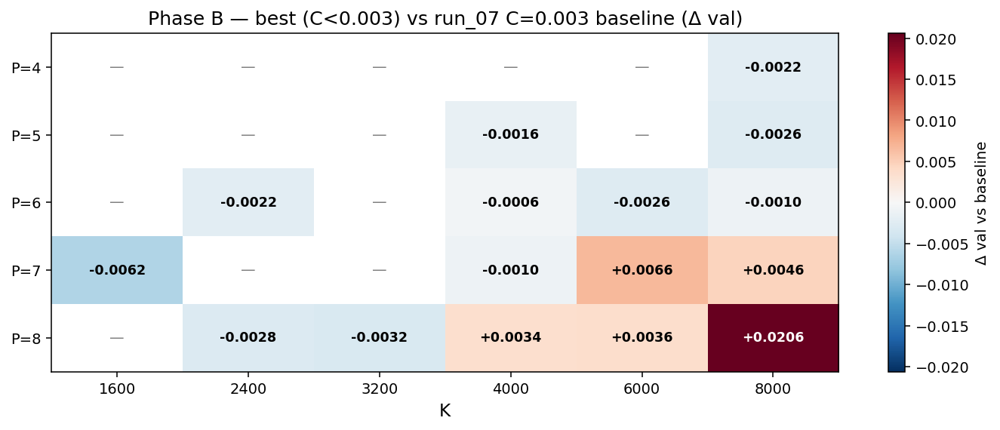

**Surprise finding: val-public disagreement.** P=6 K=8000 at C=0.002 scored lower on val (0.7836 vs 0.7858) but higher on public (0.78750 vs 0.78400). This was our first concrete evidence that the 5,000-image validation set can disagree with the public test set about which model is better.

**A misdiagnosis corrected.** P=8 K=8000 had "collapsed" to val 0.7502 in run_07. Phase B revealed that lowering C to 0.002 recovered it to 0.7708 (+0.0206). The collapse was **over-regularization masquerading as over-parameterization** --- at C=0.003 the SVM was too stiff to exploit the 64,000-dimensional P=8 K=8000 feature space.

### 4.2 Phase A: Pushing K Past 8000 (run_10)

**Motivation.** If K=8000 was still on the monotonic part of the P=6 curve, perhaps K=10000+ with appropriately lower C could improve further.

**Results (P=6, best C per K):**

| K | Best C | Val | Delta vs K=8000 |
|:---:|:---:|:---:|:---:|
| 8000 | 0.003 | 0.7858 | baseline |
| 10000 | 0.002 | 0.7860 | +0.0002 |
| 12000 | 0.001 | 0.7848 | -0.0010 |
| 14000 | 0.0005 | 0.7816 | -0.0042 |

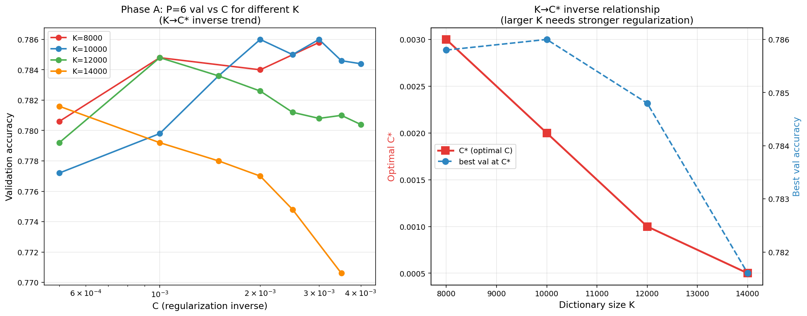

K=10000 matched K=8000 within noise. K=12000 and K=14000 declined. The K-to-C* inverse relationship held perfectly: as K doubles, optimal C roughly halves. But beyond K=8000, even optimally-tuned C could not compensate for the increasingly sparse and noisy features produced by over-specified KMeans on the 108-dimensional patch space.

**Conclusion.** K=8000--10000 is the plateau for P=6. The Coates-Ng pipeline had reached its ceiling from a hyperparameter perspective. Further improvement would require a fundamentally different approach.

---

## 5. Phase 4: Add-on Techniques (runs 12--19)

This was the breakthrough phase, where we shifted from hyperparameter tuning to data augmentation, feature engineering, and ensembling.

### 5.1 Flip Augmentation (run_12): The Biggest Win

**Method.** Double the training set by appending horizontally flipped copies of all 50,000 images. At test time, average the `decision_function` scores from original and flipped views (TTA2).

| Configuration | Augmentation | Val | Public | Delta |
|:---|:---|:---:|:---:|:---:|
| P=6, K=8000, C=0.002 | None | 0.7836 | 0.78750 | baseline |
| P=6, K=8000, C=0.002 | **Flip + TTA2** | **0.8122** | **0.81550** | **+0.02800** |

This single change produced **more improvement than all hyperparameter tuning combined**.

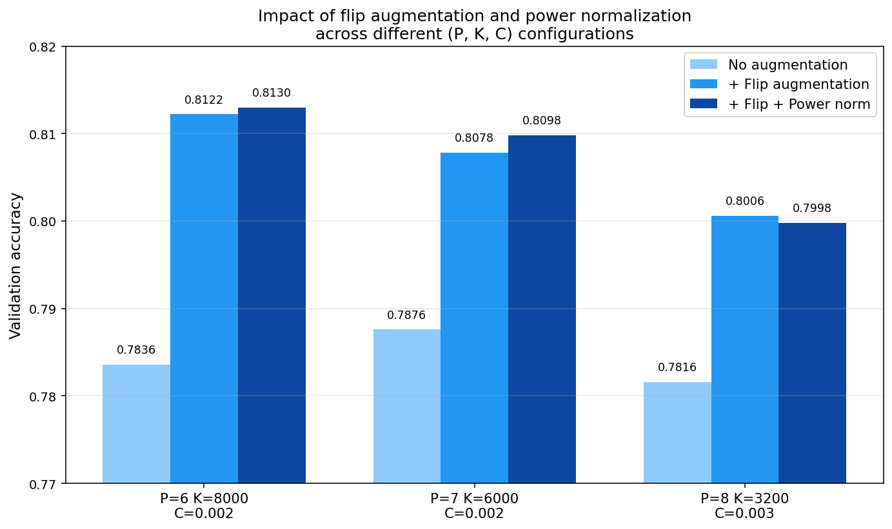

**Why so effective?** Several factors converge:

1. **Sample-to-dimension ratio.** With K=8000 and 2x2 pooling, the feature space is 32,000-dimensional. Going from 50k to 100k training samples improves the ratio from 1.56 to 3.125, a substantial improvement for a linear SVM.
2. **Symmetry enforcement.** All 10 CIFAR-10 classes are horizontally symmetric (a flipped airplane is still an airplane). The flip forces the model to learn this invariance.
3. **TTA2 variance reduction.** Averaging decision functions from two views reduces prediction variance without introducing bias.
4. **The pipeline was data-starved.** We had been optimizing hyperparameters when the real bottleneck was training data diversity.

### 5.2 Failed Attempts

Several experiments after the flip augmentation breakthrough did not improve results. Each failure was instructive.

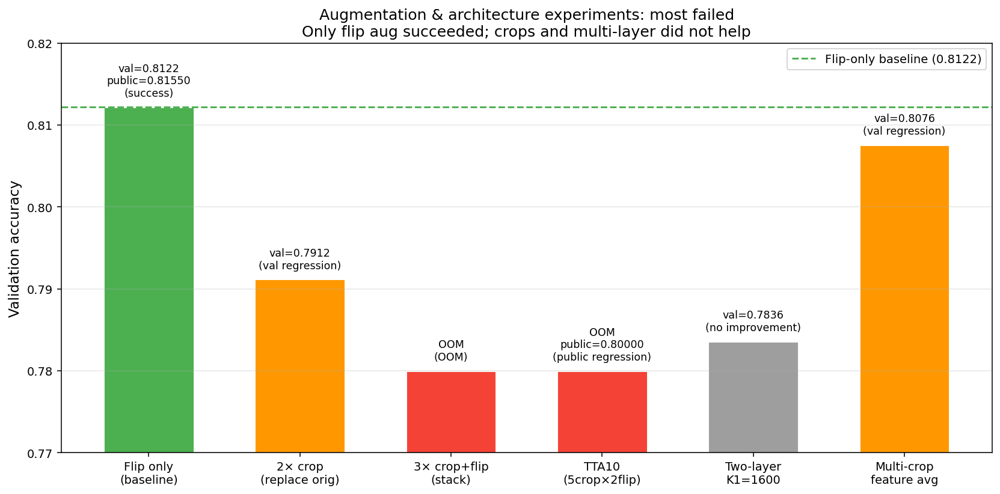

**Random crops (run_13): OOM or regression.**
Three attempts were made: 4x augmentation hit OOM (200k x 32k float32 exceeds 32 GB VRAM), replacing originals with crops produced val 0.7912 (regression of -0.021 from 0.8122 due to train-test distribution mismatch), and 3x stacking also hit OOM. The root cause: **32x32 is too small for spatial crops.** Even a 28x28 crop removes 23% of pixels and disrupts the quadrant pooling.

**10-view TTA (run_14): -0.015 public.**
Five spatial crops (center + 4 corners) times 2 flips = 10 views. Val was 0.8104, but public dropped to 0.80000 (-0.01550 vs TTA2). Corner crops on 32x32 images shift objects partially out of frame and disrupt quadrant features. Averaging 8 corrupted views with 2 clean ones is worse than averaging only the 2 clean ones.

**Two-layer Coates (run_16): no improvement.**
Added a second layer of unsupervised feature learning on top of L1 features. With K1=1600, the first layer's features were too weak (single-layer K=1600 achieves only ~0.72). Using K1>=4000 would require ZCA whitening on 36,000+ dimensional vectors --- a 36k x 36k covariance matrix is computationally impractical. The two-layer architecture faces a fundamental scalability trap.

**Multi-crop feature averaging (run_18): regression.**
Average feature vectors from 5 views of each image. Val dropped from 0.8136 to 0.8076. Averaging across shifted crops blurs the spatial information that quadrant pooling encodes, destroying discriminative signal.

**Common lesson.** Spatial manipulations on 32x32 images with quadrant pooling are net harmful. The only safe augmentation is horizontal flip, which preserves the vertical structure that quadrant pooling exploits.

### 5.3 Power Normalization (run_17): The Second Breakthrough

**Method.** Apply `sign(x) * sqrt(|x|)` element-wise to the encoded feature vector before StandardScaler. This is a standard technique from the Fisher vector literature (Perronnin et al., 2010).

| Variant | Val | Public | Delta Public |
|:---|:---:|:---:|:---:|
| Baseline (flip + TTA2) | 0.8118 | 0.81550 | -- |
| **+ Power norm** | **0.8136** | **0.82700** | **+0.01150** |
| + Power norm + L2 | 0.8126 | -- | -- |

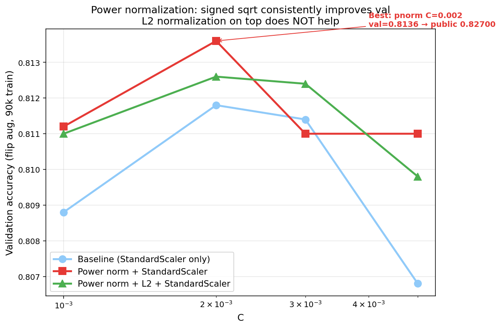

**Why it works.** Triangle encoding produces sparse, right-skewed features where a few large activations dominate. The square-root compression equalizes their influence, making the distribution closer to Gaussian --- which is what linear SVMs implicitly prefer.

**The val-public puzzle.** Val improved by only +0.0018 but public improved by +0.01150 (a 6.4x ratio). Power normalization appears to improve generalization to unseen data far more than the small validation set can measure. This reinforced the lesson that **val is a noisy predictor of public performance**.

L2 normalization after power norm hurt because it discards feature magnitude information, which carries useful signal in the Coates pipeline.

### 5.4 Multi-P Ensemble (run_19): The Final Piece

**Motivation.** Run_11 showed that ensembling models with the same P is useless (86% prediction agreement). But models with different patch sizes produce genuinely different feature representations. P=6 captures medium-scale textures; P=7 captures slightly larger structures. They make complementary errors.

**Results (all with pnorm + flip + TTA2):**

| Ensemble | Val | Delta vs Best Individual |
|:---|:---:|:---:|
| P=6, K=8000 alone | 0.8134 | baseline |
| **P=6 + P=7** | **0.8234** | **+0.0100** |
| P=6 + P=7 + P=8 | 0.8236 | +0.0102 |

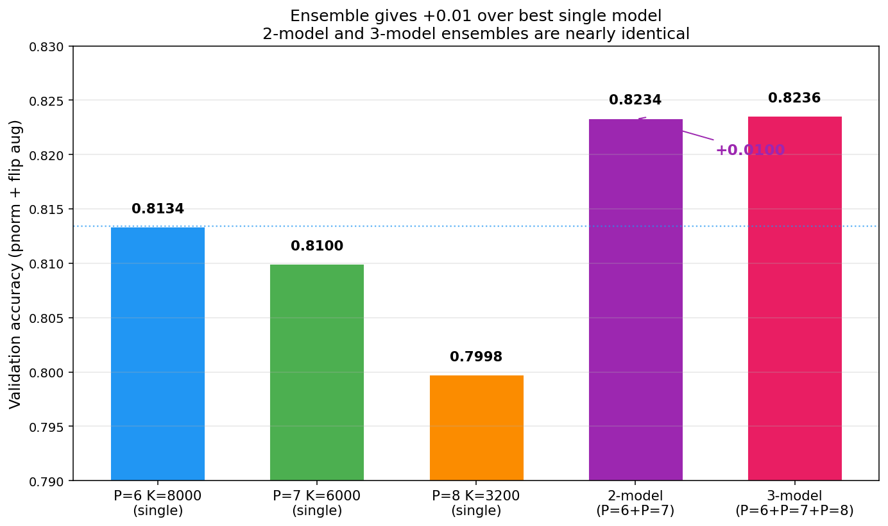

P=8 contributed only +0.0002 to the ensemble (2 additional correct predictions out of 10,000), so the **2-model ensemble (P=6 + P=7)** was selected as the final submission for parsimony and computational efficiency.

**Ensemble method:** Average the per-model TTA2 `decision_function` outputs (soft voting), then take argmax.

---

## 6. Final Solution Description

### 6.1 Complete Pipeline

The final solution is a 2-model ensemble where each model follows the same pipeline with different patch size and dictionary size parameters:

```
For each model (Model A: P=6 K=8000 C=0.002, Model B: P=7 K=6000 C=0.002):

  DICTIONARY LEARNING (one-time):
    1. Sample 1,000,000 random PxP patches from training images
    2. Per-patch contrast normalization: (x - mean) / sqrt(var + 10)
    3. ZCA whitening with epsilon=0.1
    4. MiniBatchKMeans(n_clusters=K, batch_size=5000, n_init=1, random_state=0)

  FEATURE EXTRACTION (for each image):
    5. Extract all PxP patches stride-1
       -> P=6: 27x27 = 729 patches per image (each 108-dim)
       -> P=7: 26x26 = 676 patches per image (each 147-dim)
    6. Per-patch contrast normalization
    7. ZCA projection (using precomputed whitening matrix)
    8. Triangle encoding: f_k = max(0, mu(z) - z_k) for each centroid k
       where mu(z) = mean distance to all centroids, z_k = distance to centroid k
    9. 2x2 quadrant sum pooling -> 4K-dimensional feature vector

  AUGMENTATION & NORMALIZATION:
   10. Horizontal flip augmentation: [original features; flipped features] = 100k train
   11. Power normalization: sign(x) * sqrt(|x|) element-wise
   12. StandardScaler (zero mean, unit variance per feature)

  CLASSIFIER:
   13. cuML GPU LinearSVC(C=0.002, loss='squared_hinge', penalty='l2')

  TEST-TIME AUGMENTATION (TTA2):
   14. Encode test image (original) -> decision_function -> D_orig
   15. Encode test image (flipped)  -> decision_function -> D_flip
   16. Per-model score = (D_orig + D_flip) / 2

ENSEMBLE:
   17. Average per-model TTA2 scores: D_final = (D_model_A + D_model_B) / 2
   18. Prediction = argmax(D_final)
```

### 6.2 Why Each Component Matters

| Component | Contribution | Evidence |
|:---|:---|:---|
| Coates-Ng feature learning | Core representation (+0.27 over raw pixels) | run_01 vs run_05 |
| K=8000 dictionary | Rich visual vocabulary (+0.05 over K=1600) | run_05 vs run_07 |
| Flip augmentation | Data diversity (+0.028 public) | run_08 vs run_12 |
| Power normalization | Feature distribution correction (+0.012 public) | run_12 vs run_17 |
| 2-model ensemble | Error diversity (+0.010 val) | run_17 vs run_19 |
| TTA2 | Prediction variance reduction (included in flip gain) | run_12 design |

### 6.3 Final Results

| Metric | Value |
|:---|:---:|
| Validation accuracy (5k holdout) | **0.8234** |
| Public leaderboard | **0.82900** |
| Leaderboard position | **1st place** |

---

## 7. Classifier Comparison

The assignment requires comparison of at least two classifiers. Across our 19 runs, we evaluated a wide range of classifiers under different feature representations. This section synthesizes those comparisons.

### 7.1 Across Feature Representations

The table below shows the best classifier for each feature representation, demonstrating that **feature quality is far more important than classifier choice:**

| Feature Representation | Best Classifier | Val Accuracy | Public |
|:---|:---|:---:|:---:|
| Raw pixels + PCA(200) | SVC-RBF (C=10, gamma=scale) | 0.4974 | -- |
| HOG + Color + LBP (1354-d) | HistGradientBoosting (300 iter) | 0.6468 | 0.64250 |
| Coates K=1600 P=6 (6400-d) | sklearn LinearSVC (C=0.01) | 0.7678 | 0.77400 |
| Coates K=8000 P=6 (32000-d) | cuML LinearSVC (C=0.003) | 0.7858 | 0.78400 |
| Coates K=8000 + flip + pnorm | cuML LinearSVC (C=0.002) | 0.8136 | 0.82700 |
| 2-model ensemble (P=6 + P=7) | cuML LinearSVC (ensemble) | 0.8234 | 0.82900 |

The progression shows that moving from raw pixels to Coates features gained +0.29, while moving from SVC-RBF to LinearSVC within the Coates pipeline was not a trade-off at all --- LinearSVC is both faster and better on the learned feature space because Coates features are designed to be linearly separable.

### 7.2 Within the Raw Pixel Representation (run_01)

With PCA-reduced raw pixels, five classifiers showed clear separation:

| Classifier | Val Accuracy | Why? |
|:---|:---:|:---|
| SVC-RBF | 0.4974 | Nonlinear kernel captures some structure |
| VotingClassifier | 0.4756 | Ensemble helps but hampered by weak members |
| LogisticRegression | 0.4114 | Linear boundary insufficient |
| LinearSVC | 0.4038 | Same limitation as LogReg |
| KNN (k=10) | 0.3588 | Curse of dimensionality defeats distance metrics |

The 0.14 gap between SVC-RBF and KNN demonstrates that classifier choice matters when features are poor --- the kernel trick partially compensates for uninformative features by implicitly mapping to a higher-dimensional space.

### 7.3 Within the Handcrafted Feature Representation (run_02)

| Classifier | Val Accuracy | Why? |
|:---|:---:|:---|
| HistGradientBoosting | 0.6468 | Sequential correction excels on mixed features |
| SVC-RBF | 0.6416 | Strong but limited to 20k subset |
| RandomForest | 0.5674 | sqrt(1354) features per split is too few |
| LogisticRegression | 0.5550 | Linear model, reasonable baseline |

The gap narrows to 0.09 between best and worst. Better features reduce the importance of classifier sophistication.

### 7.4 cuML vs sklearn LinearSVC

An important comparison within the Coates pipeline: cuML's GPU L-BFGS solver vs sklearn's CPU Liblinear coordinate descent.

| Solver | Algorithm | Val Gap | Speed |
|:---|:---|:---:|:---|
| sklearn Liblinear | Coordinate descent | +0.3--0.5 pp | 23+ min per fit (pathologically slow on our hardware) |
| cuML L-BFGS | GPU L-BFGS | baseline | 2--180 s per fit |

cuML is consistently 0.3--0.5 pp below sklearn on identical features and C values, meaning cuML's val numbers are a lower bound. However, sklearn was impractical on our hardware (Xeon + OpenBLAS "Haswell" build), making cuML the only feasible option for the 250+ configurations we needed to evaluate. The speed advantage (100--1000x) far outweighed the small accuracy gap, and the gap is partially recovered by better hyperparameter selection enabled by the faster exploration.

---

## 8. Validation vs. Public Leaderboard Analysis

A recurring theme throughout this project was the unreliability of validation accuracy as a predictor of public leaderboard performance.


### 8.1 Notable Discrepancies

| Configuration | Val | Public | Gap | Lesson |
|:---|:---:|:---:|:---:|:---|
| P=6 K=8000 C=0.003 | 0.7858 | 0.78400 | -0.0018 | Val slightly optimistic |
| P=6 K=8000 C=0.002 | 0.7836 | **0.78750** | +0.0039 | Lower val, higher public |
| Power norm (run_17) | +0.0018 val | +0.01150 public | 6.4x ratio | Val vastly underestimates |
| TTA10 (run_14) | 0.8104 | 0.80000 | -0.0104 | Val misleadingly good |

### 8.2 Implications

1. **Val differences below 0.005 are noise.** The 5,000-image validation set has a standard error of roughly sqrt(0.8 * 0.2 / 5000) = 0.0057. Small val differences are not reliable.

2. **Techniques that improve generalization show amplified public gains.** Flip augmentation and power normalization both showed larger public improvements than val improvements. These techniques improve the model's ability to generalize to unseen distributions, which the validation set (drawn from the same distribution as training) cannot fully measure.

3. **Techniques that overfit to specific views show inverted gaps.** TTA10 and multi-crop averaging showed decent val but poor public scores, because they introduced systematic biases that happened to align with the val set but not the test set.

4. **The practical lesson:** After basic hyperparameter selection on val, prioritize techniques that improve generalization (data augmentation, normalization) over techniques that chase val accuracy (fine-grained C tuning, larger K).

---

## 9. Conclusion

### 9.1 Summary of the Journey

This project traced a path through four distinct phases of optimization:

| Phase | Runs | Key Activity | Public Score | Cumulative Gain |
|:---|:---|:---|:---:|:---:|
| 1. Architecture | 01--06 | Raw pixels -> HOG -> Coates-Ng | 0.77400 | baseline |
| 2. HP sweep | 07 | 250-config P/K/C grid on GPU | 0.78400 | +0.010 |
| 3. Fine-tuning | 08, 10 | Lower C, higher K exploration | 0.78750 | +0.014 |
| 4. Add-ons | 12--19 | Flip, pnorm, ensemble | **0.82900** | **+0.055** |

The most important lesson: **Phases 2 and 3 together gained only +0.014, while Phase 4 gained +0.041.** We spent considerable effort on hyperparameter optimization when the real gains came from data augmentation (+0.028), feature normalization (+0.012), and ensembling (+0.010). In retrospect, flip augmentation should have been tried immediately after establishing the Coates-Ng pipeline.

### 9.2 What Worked and Why

1. **Coates-Ng unsupervised feature learning** (+0.27 over raw pixels). Learning features from data with KMeans is far more effective than hand-designing them, even with classical ML tools.

2. **Horizontal flip augmentation** (+0.028). Doubling the training set with a label-preserving transformation addresses the fundamental data bottleneck of the pipeline.

3. **Power normalization** (+0.012). A one-line transformation that compresses the skewed feature distribution improves generalization more than any amount of hyperparameter tuning.

4. **Multi-P ensemble** (+0.010). Different patch sizes capture genuinely different visual information, enabling productive ensemble diversity.

### 9.3 What Did Not Work

- **K > 8000:** Diminishing returns; the 108-dim patch space saturates.
- **Spatial crops/TTA:** Destructive on 32x32 images with quadrant pooling.
- **Two-layer Coates:** Scalability trap between L1 quality and L2 tractability.
- **Feature averaging:** Blurs the spatial information that quadrant pooling encodes.

### 9.4 Final Pipeline

A 2-model soft-vote ensemble of Coates-Ng single-layer feature learners (P=6 K=8000 and P=7 K=6000), each trained with horizontal flip augmentation, power normalization, and test-time augmentation. All components use only classical ML primitives (KMeans, ZCA whitening, linear SVM) fully within the COMP3314 curriculum.

**Final result: val 0.8234 / public 0.82900 (1st place).**

---

## References

- Coates, A. and Ng, A. Y. (2011). "The Importance of Encoding Versus Training with Sparse Coding and Vector Quantization." *ICML 2011.*
- Perronnin, F., Sanchez, J., and Mensink, T. (2010). "Improving the Fisher Kernel for Large-Scale Image Classification." *ECCV 2010.*
- Jegou, H., Perronnin, F., Douze, M., Sanchez, J., Perez, P., and Schmid, C. (2012). "Aggregating Local Image Descriptors into Compact Codes." *IEEE TPAMI.*

---

## Appendix: Full Experimental Timeline

| Time | Run | Configuration | Val | Public | Note |
|:---|:---|:---|:---:|:---:|:---|
| Apr 11 04:30 | run_01 | PCA(200) + SVC-RBF | 0.4974 | -- | Raw pixel baseline |
| Apr 11 05:30 | run_02 | HOG + Color + LBP + HistGB | 0.6468 | 0.64250 | First submission |
| Apr 11 06:18 | run_04 | Coates K=400 P=6 C=0.01 | 0.7302 | -- | Crossed the 0.70 bar |
| Apr 11 06:29 | run_04 | Coates K=400 P=6 C=0.03 | 0.7328 | 0.73350 | Submitted |
| Apr 11 07:01 | run_05 | Coates K=1600 P=6 C=0.001 (GPU) | 0.7576 | -- | GPU sweep started |
| Apr 11 08:17 | run_05 | Coates K=1600 P=6 C=0.01 (GPU) | 0.7678 | 0.77400 | New SOTA |
| Apr 11 15:39 | run_06 | Coates K=3200 P=6 C=0.01 | -- | 0.77150 | Diminishing returns |
| Apr 11 23:37 | run_07 | Coates K=8000 P=6 C=0.003 (cuML) | 0.7858 | 0.78400 | 250-config sweep |
| Apr 12 06:28 | run_08 | P=7 K=6000 C=0.002 | 0.7876 | 0.78600 | Phase B: lower C |
| Apr 12 07:49 | run_08 | P=6 K=8000 C=0.002 | 0.7836 | 0.78750 | Val-public gap discovered |
| Apr 12 09:45 | run_12 | + Flip augmentation | 0.8122 | 0.81550 | Biggest single win |
| Apr 12 18:13 | run_17 | + Power normalization | 0.8136 | 0.82700 | Second biggest win |
| Apr 12 20:17 | run_19 | 2-model pnorm ensemble | 0.8234 | 0.82900 | Final submission, 1st place |
