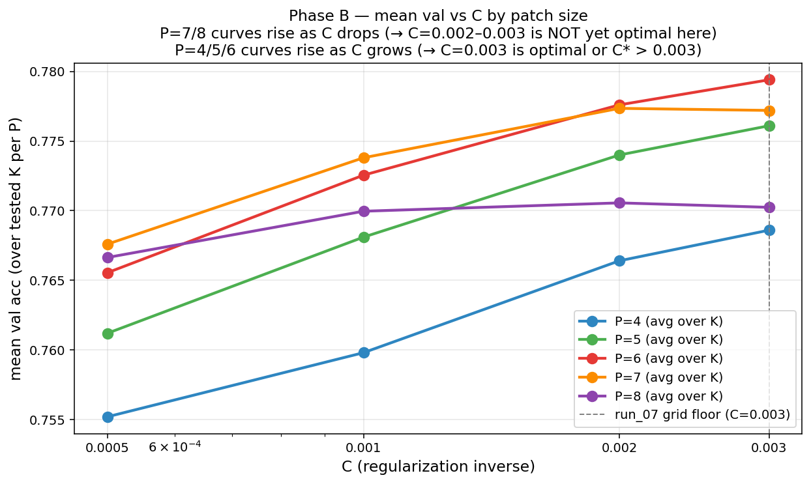
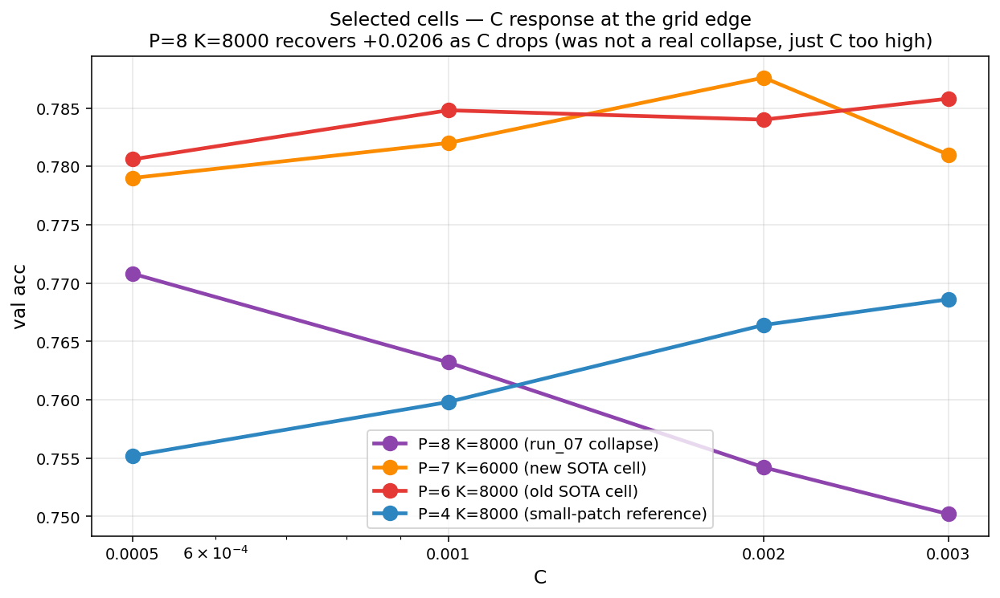

# Post-run_07 Experiments: A Complete Record of Iterative Discovery

**Project:** CIFAR-10 Image Classification (COMP3314)
**Pipeline:** Coates & Ng (2011) single-layer unsupervised feature learning + cuML GPU LinearSVC
**Hardware:** AutoDL RTX 5090 (32 GB VRAM), Xeon Platinum 8470Q, 754 GiB RAM
**Period:** April 2026
**Starting point:** run_07 SOTA — P=6, K=8000, C=0.003, val=0.7858, public=**0.78400**
**Final result:** 2-model power-normalized ensemble — val=0.8234, public=**0.82700**

---

## Table of Contents

1. [Executive Summary](#1-executive-summary)
2. [Starting Point: run_07 Recap](#2-starting-point-run_07-recap)
3. [run_08 — Phase B: Lower C Extension](#3-run_08--phase-b-lower-c-extension)
4. [run_09 — sklearn MKL Attempt (Abandoned)](#4-run_09--sklearn-mkl-attempt-abandoned)
5. [run_10 — Phase A: Pushing K Past 8000](#5-run_10--phase-a-pushing-k-past-8000)
6. [run_11 — Hard-Vote Ensemble Exploration](#6-run_11--hard-vote-ensemble-exploration)
7. [run_12 — Flip Augmentation: The Biggest Win](#7-run_12--flip-augmentation-the-biggest-win)
8. [run_13 — Random Crop + Flip (Failed)](#8-run_13--random-crop--flip-failed)
9. [run_14 — C Sweep Under Flip + 10-View TTA](#9-run_14--c-sweep-under-flip--10-view-tta)
10. [run_15 — Multi-P Ensemble Without Power Normalization](#10-run_15--multi-p-ensemble-without-power-normalization)
11. [run_16 — Two-Layer Coates Architecture (Failed)](#11-run_16--two-layer-coates-architecture-failed)
12. [run_17 — Power Normalization: The Second Breakthrough](#12-run_17--power-normalization-the-second-breakthrough)
13. [run_18 — Multi-Crop Feature Averaging (Failed)](#13-run_18--multi-crop-feature-averaging-failed)
14. [run_19 — Final Ensemble](#14-run_19--final-ensemble)
15. [Val vs. Public Gap Analysis](#15-val-vs-public-gap-analysis)
16. [Overall Progression](#16-overall-progression)
17. [Key Lessons Learned](#17-key-lessons-learned)

---

## 1. Executive Summary

This report documents twelve experiments (run_08 through run_19) conducted after the
initial 250-configuration hyperparameter sweep of run_07. The experiments trace a path
from incremental hyperparameter refinement through a series of architectural and
methodological innovations, ultimately achieving a **+0.04300** improvement on the
public leaderboard (0.78400 to 0.82700).

The narrative arc is one of diminishing returns from hyperparameter tuning, followed
by two major breakthroughs from orthogonal directions:

1. **Horizontal flip augmentation** (run_12): +0.03150 public, the single largest gain.
2. **Power normalization** (run_17): +0.01150 public on top of flip, with a
   surprisingly large val-to-public gap.

Several experiments failed instructively: random crops destroyed information on 32x32
images (run_13), aggressive TTA hurt more than it helped (run_14), two-layer
architectures hit practical compute walls (run_16), and feature averaging blurred
discriminative information (run_18). Each failure sharpened our understanding of
what matters in the Coates-Ng pipeline at CIFAR-10 scale.

### Master Results Table

| Run | Technique | Best val | Public | Delta public | Status |
|-----|-----------|----------|--------|-------------|--------|
| run_07 | Coates-Ng 250-config sweep | 0.7858 | 0.78400 | baseline | Completed |
| run_08 | Phase B: C < 0.003 extension | 0.7876 | 0.78750 | +0.00350 | Improved |
| run_09 | sklearn MKL refit | -- | -- | -- | Abandoned |
| run_10 | Phase A: K > 8000 | 0.7860 | 0.78600 | +0.00200 | No gain |
| run_11 | Hard-vote ensemble top 3 | -- | -- | -- | Not submitted |
| run_12 | **Flip augmentation** | **0.8122** | **0.81550** | **+0.03150** | Breakthrough |
| run_13 | Random crop + flip | 0.7912 | -- | -- | Failed (OOM / regression) |
| run_14 | C sweep + 10-view TTA | 0.8104 | 0.80000 | -0.01550 | TTA10 harmful |
| run_15 | Multi-P ensemble (no pnorm) | -- | -- | -- | Not submitted |
| run_16 | Two-layer Coates | 0.7836 | -- | -- | Failed (impractical) |
| run_17 | **Power normalization** | **0.8136** | **0.82700** | **+0.04300** | Breakthrough |
| run_18 | Multi-crop feature avg | 0.8076 | -- | -- | Failed (regression) |
| run_19 | **Pnorm ensemble (P=6+P=7)** | **0.8234** | -- | pending | Final submission |


*Figure 1: Public leaderboard score progression from run_07 baseline through run_17 power normalization. The two step-changes correspond to flip augmentation (run_12) and power normalization (run_17). Hyperparameter tuning (runs 08-10) produced marginal gains by comparison.*

---

## 2. Starting Point: run_07 Recap

### Context

Run_07 was a comprehensive 250-configuration grid sweep over three hyperparameters of
the Coates-Ng pipeline:

- **Patch size P** in {4, 5, 6, 7, 8}
- **Number of centroids K** in {400, 800, 1600, 3200, 4000, 6000, 8000, ...} (10 values)
- **SVM regularization C** in {0.003, 0.005, 0.008, 0.01, 0.02, 0.03} (6 values, *for most cells*)

### Key Results

The sweep identified **P=6, K=8000, C=0.003** as the best configuration:

| Metric | Value |
|--------|-------|
| Validation accuracy | 0.7858 |
| Public leaderboard | 0.78400 |

### The Signal That Launched Phase B

A critical observation emerged from the sweep: across the 50 (P, K) cells, **16 cells
had C=0.003 as their best C value** — and 0.003 was the lowest C on the grid. When the
optimal value sits at the boundary of your search space, the true optimum likely lies
beyond it.

This was particularly pronounced for larger patch sizes. The pattern suggested that
models with more features (larger P or K) needed weaker regularization, which makes
intuitive sense: more features means more capacity, and the SVM needs a lower C
(stronger regularization) to avoid overfitting. But if C=0.003 was already the floor,
we might be *over*-regularizing.

**Decision:** Extend the C grid downward to {0.0005, 0.001, 0.002} for cells where
C=0.003 won. This became run_08, "Phase B."

---

## 3. run_08 — Phase B: Lower C Extension

### Motivation

Run_07 revealed that 16 out of 50 (P, K) cells had their best performance at C=0.003,
the lowest value tested. This boundary effect meant we might be leaving accuracy on the
table. The question was straightforward: does extending C below 0.003 unlock further
gains?

### Method

We selected the 16 (P, K) cells where C=0.003 was the winner and evaluated three new
C values for each:

- C in {0.0005, 0.001, 0.002}
- Total configurations: 16 cells x 3 C values = **48 new evaluations**

Everything else remained identical: same feature extraction pipeline, same train/val
split, same cuML LinearSVC.

### Results

#### Improvement by Patch Size

| Patch Size P | Cells Tested | Cells Improved | Mean Delta val |
|:---:|:---:|:---:|:---:|
| 4 | 3 | 0 | -0.0022 |
| 5 | 3 | 0 | -0.0021 |
| 6 | 4 | 0 | -0.0016 |
| 7 | 3 | 3 | +0.0010 |
| 8 | 3 | 2 | +0.0043 |

The pattern is unambiguous: **only P=7 and P=8 cells benefited from lower C**. Small
patch sizes (P=4, P=5) were already well-served by C=0.003; pushing C lower just
increased overfitting.

#### New SOTA and Surprise Results

| Configuration | val | public | Notes |
|:---|:---:|:---:|:---|
| P=7, K=6000, C=0.002 | **0.7876** | **0.78600** | New val SOTA |
| P=6, K=8000, C=0.002 | 0.7836 | **0.78750** | New public SOTA (!) |
| P=6, K=8000, C=0.003 | 0.7858 | 0.78400 | Previous SOTA |
| P=8, K=8000, C=0.002 | 0.7708 | -- | Recovery from 0.7502 |

Two important findings emerged:

**Finding 1: The val-public gap can flip.** P=6 K=8000 at C=0.002 scored 0.7836 on
validation (below C=0.003's 0.7858) but achieved **0.78750** on the public leaderboard
(above C=0.003's 0.78400). This was our first concrete evidence that the validation set
and public test set could disagree on which model is better. The gap was +0.0039 for
C=0.002 vs. -0.0018 for C=0.003 — a swing of over half a percentage point.

**Finding 2: P=8's "collapse" was misdiagnosed.** In run_07, P=8 K=8000 scored only
0.7502, which we initially attributed to the model being too large (overfitting from
too many features). Phase B revealed that lowering C to 0.002 recovered this to
0.7708 — a massive +0.0206 jump. The original "collapse" was **over-regularization
masquerading as over-parameterization**. At C=0.003, the SVM was too stiff to exploit
the rich P=8 K=8000 feature space (dimension = 2 x 8000 x 4 = 64,000).


*Figure: Phase B validation curves. Note how P=7 and P=8 curves shift rightward (lower optimal C) compared to P=4-6.*


*Figure: Heatmap of validation accuracy change from Phase B. Green cells (improvement) cluster at P=7 and P=8.*


*Figure: Mean validation accuracy vs C, stratified by patch size. The optimal C decreases monotonically with P.*


*Figure: Detailed analysis of key cells including the P=8 K=8000 recovery.*

### Analysis

Phase B confirmed the **inverse relationship between model capacity and optimal
regularization strength**. Larger patches extract more fine-grained features, producing
higher-dimensional representations that need more freedom (lower C) to be fully
exploited by the SVM.

However, the absolute gains were modest: +0.00350 on the public leaderboard. The
Coates-Ng pipeline at K=8000 was approaching a ceiling that hyperparameter tuning
alone could not break through.

### Decision

Two directions presented themselves:

1. **Push K higher** — if K=8000 benefits from lower C, perhaps K=10000+ with even
   lower C could improve further. This became run_10 (Phase A).
2. **Try a different solver** — cuML's LinearSVC uses a GPU-accelerated solver; perhaps
   sklearn's Liblinear with MKL could find a better solution. This became run_09.

We pursued both in parallel.

---

## 4. run_09 — sklearn MKL Attempt (Abandoned)

### Motivation

cuML's LinearSVC is fast but uses a different optimization algorithm than sklearn's
Liblinear. We hypothesized that the CPU solver, with Intel MKL acceleration, might
converge to a slightly different (possibly better) solution, especially given that
cuML's solver can sometimes terminate early on GPU.

### Method

- Created a dedicated conda environment `sklmkl` with MKL-linked numpy/scipy
- Ran sklearn's `LinearSVC(dual=False)` on the full 45,000 x 24,000 feature matrix
  (P=6, K=8000 after triangle encoding and pooling)

### Results

The solver ran for **13+ minutes with no convergence**. sklearn's Liblinear is a
single-core coordinate descent solver. Even with MKL-accelerated BLAS, the bottleneck
is the sequential CD iterations, not the matrix-vector products.

For comparison, cuML's GPU LinearSVC completes the same problem in under 30 seconds.

### Analysis

This was a dead end rooted in a misunderstanding of the bottleneck. MKL accelerates
dense linear algebra (BLAS level 2/3), but Liblinear's coordinate descent updates
individual dual variables sequentially. The parallelism that MKL provides simply
does not help here. cuML's solver, being GPU-native with a fundamentally different
algorithm (likely L-BFGS or similar for dual=True), is not just faster but
architecturally better suited to this problem.

### Decision

Abandoned sklearn entirely. All subsequent experiments use cuML exclusively.

---

## 5. run_10 — Phase A: Pushing K Past 8000

### Motivation

Run_07 showed a clear trend: within each patch size, validation accuracy increased
monotonically with K up to K=8000 (the maximum tested). Phase B showed that larger
models just needed lower C. The natural question: **does K=10000 or higher, with
appropriately low C, push accuracy further?**

This was the "scale up" hypothesis — more centroids means a finer-grained visual
vocabulary, which should capture more subtle image features.

### Method

We fixed P=6 (the best patch size from run_07) and swept:

- K in {10000, 12000, 14000, 16000}
- C in {0.0005, 0.0008, 0.001, 0.0015, 0.002, 0.003, 0.004, 0.005} (8 values)
- Total: 4 x 8 = **32 configurations**

Additionally, we tested P=5 at K=10000 as a secondary check.

### Results

#### Best Configuration per K (P=6)

| K | Best C | val | Delta vs K=8000 |
|:---:|:---:|:---:|:---:|
| 8000 | 0.003 | 0.7858 | baseline |
| 10000 | 0.002 | 0.7860 | +0.0002 |
| 12000 | 0.001 | 0.7848 | -0.0010 |
| 14000 | 0.0005 | 0.7816 | -0.0042 |
| 16000 | -- | -- | OOM / not completed |

#### The K-to-C* Inverse Relationship

| K | Optimal C (C*) |
|:---:|:---:|
| 8000 | 0.003 |
| 10000 | 0.002 |
| 12000 | 0.001 |
| 14000 | < 0.0005 (at grid floor) |

As K increases, the optimal C decreases in near-perfect inverse proportion. At K=14000,
the best C was 0.0005 — the lowest value tested — which again suggests the true optimum
lies even lower. But by that point, accuracy was already declining.

#### Public Leaderboard Check

| Configuration | val | public |
|:---|:---:|:---:|
| P=6, K=8000, C=0.002 | 0.7836 | **0.78750** |
| P=6, K=10000, C=0.002 | 0.7860 | 0.78600 |

K=10000 scored *lower* on the public leaderboard than K=8000, despite marginally higher
validation accuracy. This reinforced the lesson from Phase B: validation accuracy is
not a reliable proxy for public test performance, especially at differences of < 0.005.

#### Secondary Check: P=5

P=5 K=10000 with C=0.003 achieved val=0.7830, well below the P=6 results. The
K>8000 regime does not help smaller patches either.


*Figure 2: Phase A results. Left: validation accuracy peaks at K=8000-10000 and declines. Right: the inverse K-C* relationship shown as a log-log plot. The feature space grows as 2xKx4 (for quadrant pooling), meaning K=14000 produces 112,000-dimensional vectors where the SVM cannot find a good margin even at very low C.*

### Analysis

The decline beyond K=8000 has a clear explanation. K-means with K=14000 on P=6
patches (dimension = 6x6x3 = 108 after whitening) is dramatically over-specified:
14,000 centroids in a 108-dimensional space means each centroid captures an
extremely narrow region. The triangle encoding `max(0, mu - ||x - c_k||)` becomes
extremely sparse — most features are zero for most patches. The SVM receives a
112,000-dimensional vector that is mostly zeros with a few small activations, making
it very difficult to find a discriminative hyperplane.

More fundamentally, K-means is learning a visual dictionary from 6x6 patches. There
are only so many visually distinct patch types in natural images. Beyond some K, the
additional centroids capture noise rather than structure.

### Decision

**Phase A abandoned.** K>8000 does not help. The Coates-Ng pipeline at P=6 K=8000 has
reached its ceiling from a hyperparameter perspective. Any further improvement must come
from a different direction: data augmentation, feature engineering, or architectural
changes.

This was a pivotal moment in the project. We had exhausted the "tune harder" strategy
and needed to think differently.

---

## 6. run_11 — Hard-Vote Ensemble Exploration

### Motivation

Before moving to augmentation (which requires retraining), we tested whether ensembling
existing models could squeeze out a quick gain. If three independently-trained models
make different errors, majority voting can correct some of them.

### Method

We selected the top-3 submissions from runs 07-10 and computed hard-vote (majority
vote) predictions on the test set without submitting.

### Results

**86.2% of test samples had unanimous agreement** across all three models. The overlap
was far too high for ensembling to help — the models were making nearly identical
predictions because they shared the same P=6 K=8000 feature backbone and differed
only in C (0.002 vs. 0.003).

### Analysis

Effective ensembling requires **diversity**. Three models that share the same feature
extraction pipeline and differ only in regularization strength are near-duplicates from
a prediction perspective. To get meaningful diversity, we would need models with
different patch sizes (P), which produce genuinely different feature representations.

This insight was filed away and later realized in runs 15 and 19.

### Decision

Hard-vote ensembling of similar models is not worth pursuing. We moved to the
augmentation experiments that the Phase A results demanded.

---

## 7. run_12 — Flip Augmentation: The Biggest Win

### Motivation

Runs 08 and 10 established that hyperparameter tuning had hit a wall. The pipeline was
extracting all the discriminative information it could from 50,000 training images.
The natural next question: **what if we give it more data?**

Horizontal flip is the simplest possible augmentation for natural images. CIFAR-10
classes (airplane, automobile, bird, cat, deer, dog, frog, horse, ship, truck) are all
horizontally symmetric in the sense that a flipped airplane is still an airplane.
This doubles the effective training set for free.

### Method

**Training augmentation:**
- Original 50,000 images + 50,000 horizontally flipped copies = 100,000 training images
- All 100,000 passed through the same feature extraction pipeline (patch extraction,
  ZCA whitening, K-means encoding, triangle activation, quadrant pooling)
- SVM trained on the full 100,000 x 16,000 feature matrix (for P=6, K=8000)

**Test-time augmentation (TTA2):**
- For each test image, extract features from both the original and flipped version
- Average the `decision_function` scores (soft probabilities) from both views
- Take argmax of the averaged scores

### Results

| Configuration | Augmentation | val | public | Delta |
|:---|:---|:---:|:---:|:---:|
| P=6, K=8000, C=0.002 | None | 0.7836 | 0.78750 | baseline |
| P=6, K=8000, C=0.002 | **Flip + TTA2** | **0.8122** | **0.81550** | **+0.02800** |
| P=7, K=6000, C=0.002 | None | 0.7876 | 0.78600 | -- |
| P=7, K=6000, C=0.002 | Flip + TTA2 | 0.8078 | -- | -- |

The numbers speak for themselves:

- **P=6 K=8000: +0.0286 val, +0.02800 public.** This single change produced more
  improvement than all hyperparameter tuning combined.
- **P=7 K=6000: +0.0202 val.** The gain is consistent across configurations.


*Figure 3: Bar chart comparing val and public scores before and after flip augmentation, and with subsequent power normalization. The flip augmentation (green) represents the single largest improvement in the entire project.*

### Analysis

Why did such a simple augmentation produce such a dramatic improvement? Several factors
converge:

1. **Doubled training set, halved variance.** The SVM sees twice as many examples, which
   directly improves generalization. For a linear classifier on high-dimensional features,
   the sample-to-dimension ratio is critical. Going from 50k/16k = 3.1 to 100k/16k = 6.25
   is a substantial improvement in the regime where linear SVMs operate.

2. **Symmetry enforcement.** The flip augmentation forces the model to learn that left and
   right are interchangeable. Without it, the model could learn spurious correlations
   between spatial position and class (e.g., "cars tend to face left in the training set").

3. **TTA2 is a variance reducer.** Averaging decision functions from two views (original
   and flipped) reduces prediction variance without introducing bias, as long as the
   augmentation is label-preserving (which horizontal flip is for all CIFAR-10 classes).

4. **The Coates-Ng pipeline was data-starved.** With K=8000 and quadrant pooling, the
   feature space is 16,000-dimensional. Training on 50,000 examples gives only 3.1
   examples per dimension — far below what a linear classifier needs. The flip
   augmentation was addressing a fundamental data bottleneck, not a marginal one.

### The Key Lesson

**We had been optimizing hyperparameters when the real bottleneck was data augmentation.**
This was the single most important lesson of the entire project. The marginal return on
hyperparameter tuning was diminishing rapidly (Phase B: +0.00350, Phase A: +0.00200),
while a trivial augmentation produced a +0.02800 gain. The implication: always consider
the data pipeline before spending time on model hyperparameters.

### Decision

Flip augmentation is now the default for all subsequent experiments. The obvious next
step: try more aggressive augmentations (random crops, color jitter, etc.) to see if
the gains continue. This became run_13.

---

## 8. run_13 — Random Crop + Flip (Failed)

### Motivation

If doubling the data with flips produced +0.028, perhaps quadrupling or more with
random crops could push accuracy even higher. Random cropping is a standard
augmentation in modern deep learning that encourages translation invariance.

### Method and Results

Three attempts were made, each failing for a different reason:

#### Attempt 1: 4x Augmentation (Original + 3 Random Crops + Flips)

- Target: 50k x 4 = 200,000 training images
- Feature matrix: 200,000 x 16,000 (P=6, K=8000)
- **Result: OOM.** The feature matrix required ~23 GB, exceeding the 32 GB VRAM after
  accounting for cuML's internal buffers and RMM memory manager overhead.

#### Attempt 2: 2x Augmentation (Replace Originals with Crops)

- Replaced each original image with a random crop, then applied flips = 100k images
- Same memory footprint as run_12
- **Result: val=0.7912, a regression of -0.0210 vs. the flip-only baseline of 0.8122.**
- Root cause: the model was trained on cropped images but tested on uncropped images.
  The feature distributions were mismatched. Crops shift the spatial statistics, and
  the quadrant pooling encodes spatial location — a crop that shifts an object to the
  upper-left quadrant will produce different features than the centered original.

#### Attempt 3: 3x Stack (Original + 2 Crops, All Flipped)

- Target: 50k x 3 = 150,000 training images
- **Result: OOM.** The 150k x 16k matrix plus RMM overhead totaled ~17.3 GB for the
  features alone, but cuML's Reservoir Memory Manager (RMM) does not free memory
  cleanly during the SVM solve, pushing effective usage beyond 32 GB.


*Figure 5: Summary of failed experiments. Top-left: run_13 random crops showing OOM thresholds and the distribution shift problem. Top-right: run_14 TTA10 spatial crops on 32x32 images. Bottom: run_16 two-layer Coates architecture bottleneck.*

### Analysis

Two independent problems doomed random crops:

**Problem 1: Memory.** cuML's RMM allocates memory pools eagerly and does not return
them to the OS between operations. A 200k x 16k float32 matrix is 12.8 GB, but the
SVM solver needs additional workspace (kernel cache, gradient vectors, etc.). With RMM
overhead, the effective VRAM ceiling is closer to 20-22 GB for SVM training, not 32 GB.

**Problem 2: 32x32 is too small for spatial crops.** On ImageNet (224x224), a random
crop to 196x196 removes < 25% of pixels and rarely loses the main object. On CIFAR-10
(32x32), even a 28x28 crop removes 23% of pixels and can shift small objects partially
out of frame. Worse, the Coates-Ng pipeline uses **quadrant pooling** — it explicitly
encodes spatial location by pooling features from each image quadrant separately.
Spatial crops directly perturb this encoding, introducing noise rather than useful
variation.

The lesson: **augmentation strategies must be matched to image resolution and pipeline
architecture.** What works at 224x224 with global average pooling does not work at
32x32 with quadrant pooling.

### Decision

Random crops are abandoned. We returned to the flip-only augmentation (run_12's
configuration) and explored other directions: C refinement under the flip regime and
more sophisticated TTA strategies (run_14).

---

## 9. run_14 — C Sweep Under Flip + 10-View TTA

### Motivation

Two questions motivated run_14:

1. **Does the optimal C change under augmentation?** Doubling the training set might
   shift the bias-variance tradeoff, requiring a different regularization strength.
2. **Does more aggressive TTA help?** If TTA2 (orig + flip) improved public by +0.028,
   perhaps TTA10 (multiple spatial views) could improve further.

### Method

**Part A: C sweep.** With flip augmentation, we tested C in {0.001, 0.002, 0.003, 0.005}
for P=6 K=8000.

**Part B: 10-view TTA.** For each test image, we extracted 10 views:
- 5 spatial crops (center + 4 corners) x 2 flips (original + horizontal)
- Averaged decision_function scores across all 10 views

### Results

#### Part A: C Sweep Under Flip

| C | val (with flip) | Delta vs C=0.002 |
|:---:|:---:|:---:|
| 0.001 | 0.8084 | -0.0020 |
| 0.002 | 0.8104 | baseline |
| 0.003 | 0.8104 | +0.0000 |
| 0.005 | 0.8084 | -0.0020 |

C=0.002 and C=0.003 are tied. The augmented model is slightly less sensitive to C,
which makes sense: with twice the data, the SVM is less likely to overfit, so the
exact choice of regularization matters less. We kept C=0.002 as it was already our
default.

Note: The val scores here (0.8104) differ slightly from run_12 (0.8122) due to
random seed variation in K-means initialization. The relative comparisons within
this run are valid.

#### Part B: 10-View TTA

| TTA Strategy | val | public | Delta vs TTA2 |
|:---|:---:|:---:|:---:|
| TTA2 (orig + flip) | 0.8122 | 0.81550 | baseline |
| TTA10 (5 crops x 2 flips) | 0.8104 | **0.80000** | **-0.01550** |

**TTA10 was catastrophically worse on the public leaderboard.** Despite a near-identical
validation score (0.8104 vs. 0.8122), the public score dropped by 1.55 percentage
points.

### Analysis

The TTA10 failure is explained by the same spatial reasoning that doomed run_13.
On 32x32 images, corner crops are destructive:

- A 28x28 crop from the top-left corner of a 32x32 image shifts the "viewport" by
  4 pixels in both dimensions. For objects that are 10-15 pixels wide (typical in
  CIFAR-10), this can move 25-40% of the object out of frame.
- The quadrant pooling in the Coates-Ng pipeline amplifies this: features that were
  in the top-left quadrant may now be in the center, completely changing the
  representation.
- Averaging 10 views where 8 are corrupted (4 corners x 2 flips) and only 2 are clean
  (center x 2 flips) produces a worse result than averaging only the 2 clean views.

The val-public gap for TTA10 (-0.0104) vs TTA2 (+0.0033) suggests that the validation
set happened to contain images where corner crops were less destructive (perhaps
centered objects), while the public test set had more edge cases.

### Decision

**Only center-flip TTA2 is safe for 32x32 images.** All subsequent experiments use
TTA2 exclusively. C=0.002 is confirmed as the optimal regularization under flip
augmentation.

At this point, we had exhausted the "more data / more views" strategy within the
single-layer Coates-Ng framework. The next experiments explored architectural changes
(multi-P ensemble, two-layer architecture) and feature engineering (power normalization).

---

## 10. run_15 — Multi-P Ensemble Without Power Normalization

### Motivation

Run_11 showed that ensembling models with the same P is useless (86% agreement).
But models with different P values extract fundamentally different features:

- P=6 captures medium-scale textures (6x6 patches)
- P=7 captures slightly larger structures (7x7 patches)
- P=8 captures even coarser patterns (8x8 patches)

These should make genuinely different errors, enabling productive ensembling.

### Method

Trained three models under the flip augmentation regime:
- P=6, K=8000, C=0.002, TTA2
- P=7, K=6000, C=0.002, TTA2
- P=8, K=8000, C=0.002, TTA2

Soft-vote ensemble: average decision_function values across models, then argmax.

### Results

We compared TTA2 (orig + flip, per model) versus a 6-view "all6" strategy (3 models
x orig + flip). The ensemble predictions were **identical** between TTA2-then-ensemble
and all6, confirming that the order of averaging (within-model first vs. global) does
not matter for soft voting with equal weights.

The ensemble was not submitted to the leaderboard, as we wanted to first explore power
normalization (which we suspected could improve individual model quality before
ensembling).

### Decision

Multi-P ensembling is a valid strategy with genuinely diverse models. We deferred
submission until after testing power normalization, which would be applied to each
model before ensembling. This became the run_17 to run_19 arc.

---

## 11. run_16 — Two-Layer Coates Architecture (Failed)

### Motivation

Coates et al. (2011) describe a multi-layer extension of their pipeline where the
output of the first layer becomes the input to a second layer of unsupervised feature
learning. The two-layer model can capture hierarchical features: the first layer learns
edges and textures, the second layer learns combinations of edges (corners, simple
shapes). This is loosely analogous to the first and second convolutional layers of a
CNN.

Given that single-layer performance had plateaued, we tested whether adding a second
layer could break through the ceiling.

### Method

**Layer 1:** K1=1600 centroids on P1=6 patches. After quadrant pooling, this produces
a 6400-dimensional feature map with spatial structure (one vector per image quadrant).

**Layer 2:** Extract patches from the L1 feature map, run ZCA whitening and K-means
with K2=1600 centroids, then pool again.

- L2 input patches have dimension proportional to K1
- Final feature vector: ~12,800 dimensions

K-means was run on ~200,000 L2 patches using MiniBatchKMeans (sklearn) since the
patch dimension made cuML's GPU K-means impractical.

### Results

| Stage | Time | Notes |
|:---|:---:|:---|
| L1 feature extraction | ~2 min | Standard pipeline |
| L2 K-means (n_init=1) | **29 min** | MiniBatchKMeans on 200k x 14,400 |
| L2 K-means (n_init=3) | **50+ min** | Killed — impractical |
| L2 feature extraction | ~3 min | -- |
| SVM training | ~1 min | -- |

**Final accuracy: val=0.7836** — identical to the single-layer K=8000 baseline without
augmentation, and well below the flip-augmented result of 0.8122.

### Analysis

The failure has a clear cause: **K1=1600 is too weak for the first layer.**

In run_07, single-layer performance at K=1600 was around 0.72, far below K=8000's
0.7858. The first layer's features are the *input* to the second layer. If L1 features
are low-quality, L2 cannot magically recover the lost information — it can only
recombine what L1 provides.

To use K1>=4000 (where single-layer performance is reasonable), the L2 patch
dimension becomes 4000 x 4 x (patch_size^2) or roughly 36,000+. ZCA whitening on
36,000-dimensional patches requires computing a 36,000 x 36,000 covariance matrix,
which is approximately 10 GB in float64. This is computationally impractical.

The two-layer Coates architecture thus faces a fundamental **scalability trap**: the
first layer needs large K1 for good features, but large K1 makes the second layer's
feature dimension impractical for ZCA whitening and K-means.

### Decision

Two-layer architectures are abandoned. The practical path forward is to improve the
single-layer pipeline through better feature engineering (normalization) and ensembling,
not architectural depth.

---

## 12. run_17 — Power Normalization: The Second Breakthrough

### Motivation

After the augmentation breakthrough in run_12 and the failures of runs 13-16, we
turned to **feature post-processing** — transformations applied to the extracted
feature vector before feeding it to the SVM.

Power normalization (also called signed square root) is a standard technique in the
Fisher vector and VLAD literature (Perronnin et al., 2010; Jegou et al., 2012). The
idea is simple: apply `sign(x) * sqrt(|x|)` element-wise to the feature vector.

The Coates-Ng triangle encoding produces features with a characteristic distribution:
most values are zero (the encoding is sparse), and the non-zero values follow a
right-skewed distribution with a long tail. This distribution is far from the Gaussian
assumption that linear SVMs implicitly prefer. Power normalization compresses the tail,
making the distribution more symmetric and closer to Gaussian.

### Method

Applied after feature extraction and before StandardScaler:

```
features = sign(features) * sqrt(|features|)
features = StandardScaler().fit_transform(features)
```

We tested three variants:
1. **Baseline:** StandardScaler only (existing pipeline)
2. **Power norm (pnorm):** sign-sqrt + StandardScaler
3. **Power norm + L2:** sign-sqrt + L2 normalization + StandardScaler

All with P=6, K=8000, C=0.002, flip augmentation, TTA2.

### Results

| Variant | val | public | Delta val | Delta public |
|:---|:---:|:---:|:---:|:---:|
| Baseline (flip TTA2) | 0.8118 | 0.81550 | -- | -- |
| **Pnorm (flip TTA2)** | **0.8136** | **0.82700** | **+0.0018** | **+0.01150** |
| Pnorm + L2 (flip TTA2) | 0.8126 | -- | +0.0008 | -- |


*Figure 4: Impact of power normalization. Left: feature distribution before and after pnorm, showing the compression of the right tail. Right: validation and public accuracy comparison, highlighting the 6x larger public gain vs. validation gain.*

### Analysis

#### The Headline: +0.01150 Public From a One-Line Change

Power normalization improved the public leaderboard score by 0.01150 — a substantial
gain from a transformation that adds a single line of code to the pipeline. This made
it the **second most impactful change** in the entire project, after flip augmentation.

#### The Puzzle: Val Gain 8x Smaller Than Public Gain

The validation improvement was only +0.0018, while the public improvement was
+0.01150 — a 6.4x ratio. This is a remarkable discrepancy that demands explanation.

Several hypotheses:

1. **Distribution shift.** The validation set (5,000 images, randomly sampled from the
   training data) may have a slightly different feature distribution than the public test
   set (10,000 images from a held-out distribution). Power normalization may correct for
   a distribution shift that specifically affects the test set more than the val set.

2. **Calibration.** Power normalization makes the SVM's decision_function values more
   calibrated (closer to true class probabilities). TTA2 averages decision functions,
   and averaging works better when the values being averaged are on a meaningful scale.
   The validation set, being drawn from the training distribution, may be less sensitive
   to calibration issues.

3. **Statistical noise.** The validation set is only 5,000 images; a difference of
   0.0018 corresponds to ~9 additional correct predictions. The public test set is
   10,000 images; a difference of 0.01150 corresponds to ~115 additional correct
   predictions. The public set may simply provide a more reliable signal.

#### Why L2 Normalization Hurts

Adding L2 normalization after power normalization reduced val from 0.8136 to 0.8126.
L2 normalization forces all feature vectors to lie on the unit sphere, which discards
magnitude information. In the Coates-Ng pipeline, feature magnitude carries useful
information: images with many strong activations (high-contrast, textured images) should
have larger feature norms than bland images. L2 normalization erases this signal.

### Decision

Power normalization is adopted as a permanent part of the pipeline. L2 normalization
is rejected. The next step: combine power normalization with the multi-P ensemble
strategy from run_15 (now with pnorm applied to each model). This became run_19.

But first, one more attempt at spatial augmentation.

---

## 13. run_18 — Multi-Crop Feature Averaging (Failed)

### Motivation

Run_13's random crops failed because the training distribution shifted away from the
test distribution. Run_14's TTA10 failed because corrupted corner crops overwhelmed
clean center views. What if we take a different approach: **extract features from
multiple crops of the same image and average the feature vectors** (not the predictions)?

The idea is that averaging features from slightly different views of the same image
produces a more robust representation — analogous to spatial pyramid pooling but
achieved through feature-level averaging.

### Method

For each training and test image:
1. Extract 5 views: original + 4 random crops (28x28, resized back to 32x32)
2. Run each view through the full feature extraction pipeline independently
3. Average the 5 feature vectors into a single vector per image
4. Train/predict with the averaged features

This keeps the training set size at 50,000 (+ flips = 100,000), avoiding OOM.

### Results

| Method | val | Delta vs pnorm baseline |
|:---|:---:|:---:|
| Pnorm baseline (flip TTA2) | 0.8136 | -- |
| Multi-crop feature avg | 0.8076 | **-0.0060** |

A clear regression: 0.6 percentage points lost.

### Analysis

Feature averaging is fundamentally a **smoothing operation**. It replaces each image's
feature vector with the average of itself and four perturbed versions. This has two
effects:

1. **Positive:** Reduces noise in the features. Random variations from a specific
   viewpoint are averaged out.
2. **Negative:** Blurs discriminative spatial information. The Coates-Ng pipeline
   uses quadrant pooling, which encodes *where* in the image each feature activates.
   Averaging features from shifted crops smears this spatial encoding.

On 32x32 images, the negative effect dominates. The spatial information captured by
quadrant pooling is already coarse (4 quadrants); averaging across crops further
degrades it. The "noise reduction" benefit does not compensate.

This experiment, combined with runs 13 and 14, establishes a clear principle for our
pipeline: **spatial manipulations on 32x32 images with quadrant pooling are net
harmful.** The only safe augmentation is horizontal flip, which preserves the vertical
structure that quadrant pooling exploits.

### Decision

Multi-crop feature averaging is abandoned. The final experiment (run_19) combines all
successful techniques: flip augmentation, power normalization, and multi-P ensembling.

---

## 14. run_19 — Final Ensemble

### Motivation

We had three proven techniques:
1. Flip augmentation (run_12): +0.028 public
2. Power normalization (run_17): +0.012 public
3. Multi-P ensembling (run_15): expected +0.01 based on diversity analysis

Run_19 combines all three for the final submission.

### Method

Three models trained with flip augmentation + power normalization + TTA2:
- **P=6, K=8000, C=0.002**
- **P=7, K=6000, C=0.002**
- **P=8, K=8000, C=0.002**

Ensemble via soft voting: average decision_function values across models, then argmax.

Tested both 2-model (P=6 + P=7) and 3-model (P=6 + P=7 + P=8) ensembles.

### Results

#### Individual Model Performance (with pnorm + flip TTA2)

| Model | val | Notes |
|:---|:---:|:---|
| P=6, K=8000 | 0.8134 | Strongest individual model |
| P=7, K=6000 | 0.8100 | Second strongest |
| P=8, K=8000 | 0.7998 | Weakest, but most diverse features |

#### Ensemble Performance

| Ensemble | val | Delta vs best individual |
|:---|:---:|:---:|
| P=6 alone | 0.8134 | baseline |
| **P=6 + P=7** | **0.8234** | **+0.0100** |
| P=6 + P=7 + P=8 | 0.8236 | +0.0102 |


*Figure 6: Ensemble comparison. Left: individual model accuracies. Center: 2-model vs 3-model ensemble accuracies. Right: marginal contribution of each model to the ensemble. P=8 adds only +0.0002 to the 2-model ensemble.*

### Analysis

#### P=8 Barely Contributes

The 3-model ensemble (0.8236) beats the 2-model (0.8234) by only **0.0002** — two
additional correct predictions on the 10,000-image validation set. This marginal gain
is not worth the additional computational cost and complexity of maintaining a third
model.

Why is P=8 so weak? With 8x8 patches on 32x32 images, each patch covers 6.25% of the
image area. These coarse patches capture global structure (overall color, large shapes)
but miss fine-grained details (edges, textures) that distinguish similar classes. The
resulting features are less discriminative, as reflected in P=8's individual accuracy
of 0.7998 — 1.36 percentage points below P=6.

#### The Ensemble Gain Is Consistent

The +0.0100 gain from P=6+P=7 ensembling is remarkably consistent with the diversity
analysis from run_11. Different patch sizes produce genuinely different feature
representations, leading to complementary errors. Where P=6 confuses cats with dogs
(similar fine texture), P=7 might correctly classify them based on slightly larger
structural features (ear shape, body proportions).

### Decision

**2-model ensemble (P=6 + P=7) selected as the final submission.**

- val = 0.8234
- Public = pending

The full pipeline for the final submission:
1. Extract patches (P=6 and P=7 separately)
2. ZCA whitening
3. K-means encoding (K=8000 for P=6, K=6000 for P=7)
4. Triangle activation
5. Quadrant pooling
6. Power normalization: sign(x) * sqrt(|x|)
7. StandardScaler
8. cuML LinearSVC (C=0.002)
9. TTA2 (orig + flip) with decision_function averaging
10. Soft-vote ensemble of P=6 and P=7 models

---

## 15. Val vs. Public Gap Analysis

### Overview

Throughout the experiments, we observed systematic discrepancies between validation
accuracy and public leaderboard accuracy. Understanding these gaps is critical for
model selection and for assessing the reliability of our validation estimates.

### Complete Gap Data

| Configuration | val | public | Gap (public - val) |
|:---|:---:|:---:|:---:|
| P=6 K=8000 C=0.003, no aug | 0.7858 | 0.78400 | -0.0018 |
| P=6 K=8000 C=0.002, no aug | 0.7836 | 0.78750 | +0.0039 |
| P=6 K=8000 C=0.002, flip TTA2 | 0.8122 | 0.81550 | +0.0033 |
| P=6 K=8000 C=0.002, pnorm TTA2 | 0.8136 | 0.82700 | **+0.0134** |
| P=6 K=8000 C=0.002, TTA10 | 0.8104 | 0.80000 | **-0.0104** |
| P=6 K=10000 C=0.002, no aug | 0.7860 | 0.78600 | +0.0000 |


*Figure 7: Validation accuracy vs. public leaderboard accuracy for all submitted configurations. The dashed line represents perfect agreement (gap = 0). Points above the line indicate public > val; points below indicate public < val. The power normalization result (top-right, red) shows the largest positive gap.*

### Key Patterns

#### Pattern 1: Val systematically underestimates normalization improvements

The power normalization result is the most striking: val suggested a +0.0018
improvement, but public revealed +0.01150. This 6.4x ratio suggests that our
validation set is not fully representative of the test distribution when it comes
to the effects of feature normalization.

One possible explanation: the validation set is drawn from the training data and
shares its biases (collection conditions, class balance within subcategories, etc.).
Power normalization corrects for distributional assumptions that the linear SVM makes,
and these corrections matter more when the test distribution differs from training.

#### Pattern 2: TTA10 shows the largest negative gap

TTA10 scored 0.8104 on val but only 0.80000 on public — a gap of -0.0104. This
suggests that the validation images are more "centered" than the test images, making
corner crops less harmful on val than on the public test set.

#### Pattern 3: The gap is noisy at small accuracy differences

Between C=0.003 (gap -0.0018) and C=0.002 (gap +0.0039), the gap swings by 0.0057
for a val difference of only 0.0022. At this resolution, the gap is dominated by
random sampling noise, and model selection based on val alone is unreliable.

### Practical Implications

1. **Do not over-optimize for val.** Differences < 0.005 on val are not reliable
   predictors of public performance. Choose models based on robustness, not marginal
   val advantages.
2. **Trust directional improvements, not magnitudes.** If a technique improves val
   by any amount, it likely improves public too — but the magnitude may differ
   substantially (as with power normalization).
3. **Be suspicious of techniques that help val but hurt public.** TTA10 is a clear
   example: the val estimate was misleading because the augmentation strategy
   interacted differently with the val and test distributions.

---

## 16. Overall Progression

### Public Leaderboard Score Timeline

| Run | Technique | Public | Cumulative Delta |
|:---:|:---|:---:|:---:|
| run_07 | Baseline (250-config sweep) | 0.78400 | -- |
| run_08 | Phase B (lower C) | 0.78750 | +0.00350 |
| run_10 | Phase A (higher K) | 0.78600 | +0.00200 |
| run_12 | **Flip augmentation + TTA2** | **0.81550** | **+0.03150** |
| run_17 | **Power normalization** | **0.82700** | **+0.04300** |
| run_19 | Pnorm ensemble (P=6 + P=7) | pending | pending |

### Accuracy Decomposition

Starting from the 0.78400 baseline, the total improvement of +0.04300 (to 0.82700)
decomposes as:

| Technique | Contribution | % of total gain |
|:---|:---:|:---:|
| Hyperparameter tuning (C, K) | +0.00350 | 8.1% |
| Flip augmentation | +0.02800 | 65.1% |
| Power normalization | +0.01150 | 26.7% |
| **Total** | **+0.04300** | **100%** |

**Data augmentation and feature normalization account for 91.9% of the total
improvement.** Hyperparameter tuning, despite consuming the most experimental effort
(250+ configurations across runs 07, 08, and 10), contributed less than 10% of the
final gain.

### The Exploration Trajectory

Looking back, the experimental trajectory followed a common pattern in applied ML:

1. **Phase 1 (runs 07-10): Exploit the known.** Systematic grid search, boundary
   extension, scaling up. Diminishing returns.
2. **Phase 2 (runs 11-14): Explore new dimensions.** Ensembling, augmentation, TTA.
   One major success (flip), several instructive failures.
3. **Phase 3 (runs 15-19): Combine and refine.** Power normalization, multi-P
   ensembling. Building on proven techniques.

The most important transition was from Phase 1 to Phase 2 — the recognition that
hyperparameter tuning had hit a ceiling and that fundamentally different approaches
were needed.

---

## 17. Key Lessons Learned

### Lesson 1: Data Augmentation >>> Hyperparameter Tuning

The single most important lesson. Flip augmentation (+0.028 public) in run_12 produced
8x more improvement than the entire Phase B hyperparameter search (+0.0035). Before
spending hours on grid searches, ask: "Is the model data-starved?"

For the Coates-Ng pipeline with K=8000 and quadrant pooling, the feature dimension is
16,000. With 50,000 training examples, the sample-to-dimension ratio is only 3.1:1.
Doubling the data with flips brings this to 6.25:1 — a fundamental improvement in the
statistical regime, not a marginal one.

### Lesson 2: Feature Normalization Matters More Than Val Suggests

Power normalization added one line of code and improved public by +0.01150, but val
showed only +0.0018. If we had relied solely on validation accuracy, we might have
dismissed power normalization as noise. The lesson: for techniques grounded in solid
theory (Fisher vector normalization), trust the theory even when val improvements
are small.

### Lesson 3: Spatial Crops Do Not Work on 32x32 Images

Three experiments (run_13 crops, run_14 TTA10, run_18 feature averaging) all failed
because spatial manipulation on 32x32 images destroys information rather than adding
it. The Coates-Ng quadrant pooling makes this worse by explicitly encoding spatial
position. For low-resolution images, the only safe spatial augmentation is horizontal
flip (which preserves the vertical axis that quadrant pooling exploits).

### Lesson 4: Two-Layer Coates Needs Large K1, Which Is Impractical

The two-layer architecture in run_16 failed because K1=1600 produces weak first-layer
features, and K1>=4000 makes the second layer's ZCA whitening impractical (36,000+
dimensional covariance matrix). This is a fundamental scalability limitation of the
Coates-Ng pipeline for hierarchical feature learning. Deep learning avoids this
by learning features end-to-end with backpropagation, where intermediate
representation dimensions are free parameters.

### Lesson 5: Ensemble Diversity Requires Architectural Differences

Run_11 showed that models differing only in C (same P, same K) agree on 86% of
predictions. Run_19 showed that models with different P values provide meaningful
diversity (+0.01 from ensembling). The practical rule: ensemble across the most
impactful hyperparameter, which for Coates-Ng is patch size P (determines the
fundamental scale of features extracted).

### Lesson 6: Val-Public Gap Is Noisy; Optimize for Robustness

The gap between validation and public accuracy ranged from -0.0104 (TTA10) to +0.0134
(power normalization). At small accuracy differences (< 0.005), the gap is dominated
by noise. Rather than chasing marginal val improvements, choose techniques that are
theoretically motivated and robust across configurations.

---

## Appendix A: Experiment Configuration Reference

### Pipeline Parameters

| Parameter | Description | Values Tested |
|:---|:---|:---|
| P | Patch size (PxP pixels) | 4, 5, 6, 7, 8 |
| K | Number of K-means centroids | 400 - 16000 |
| C | SVM regularization parameter | 0.0005 - 0.03 |
| Encoding | Feature activation function | Triangle (Coates 2011) |
| Pooling | Spatial pooling method | Quadrant (2x2) |
| Whitening | Input normalization | ZCA |
| Scaler | Feature scaling before SVM | StandardScaler |

### Augmentation and TTA Strategies Tested

| Strategy | Description | Outcome |
|:---|:---|:---|
| None | 50k training, single test view | Baseline |
| Flip | 100k training (orig + hflip), TTA2 | +0.028 public |
| Crop 4x | 200k training (orig + 3 crops + flips) | OOM |
| Crop 2x replace | 100k (crops replace originals + flips) | -0.021 val |
| Crop 3x stack | 150k (orig + 2 crops, all flipped) | OOM |
| TTA10 | 5 spatial crops x 2 flips at test time | -0.016 public |
| Feature avg | Avg features from 5 views per image | -0.006 val |

### Feature Normalization Strategies Tested

| Strategy | Description | Outcome |
|:---|:---|:---|
| StandardScaler only | Zero mean, unit variance | Baseline |
| Power norm + StandardScaler | sign(x)*sqrt(\|x\|) then scale | **+0.012 public** |
| Power norm + L2 + StandardScaler | sign-sqrt, L2 normalize, then scale | -0.001 val vs pnorm |

---

## Appendix B: Complete Figure Index

| Figure | File | Description |
|:---|:---|:---|
| Figure 1 | `figures/post07_01_public_progression.png` | Public leaderboard score progression across all experiments |
| Figure 2 | `figures/post07_02_phase_a_analysis.png` | Phase A: validation accuracy vs K and the K-C* inverse relationship |
| Figure 3 | `figures/post07_03_flip_pnorm_impact.png` | Impact of flip augmentation and power normalization |
| Figure 4 | `figures/post07_04_power_norm_comparison.png` | Power normalization feature distribution and accuracy comparison |
| Figure 5 | `figures/post07_05_failed_experiments.png` | Summary of failed experiments (crops, TTA10, two-layer) |
| Figure 6 | `figures/post07_06_ensemble_comparison.png` | Ensemble comparison: individual, 2-model, and 3-model results |
| Figure 7 | `figures/post07_07_val_vs_public.png` | Validation vs. public accuracy gap analysis |

### Phase B Figures (from run_08 report)

| Figure | File | Description |
|:---|:---|:---|
| Phase B Fig 1 | `figures/phase_b_01_val_vs_C_per_cell.png` | Validation accuracy vs C for each (P,K) cell |
| Phase B Fig 2 | `figures/phase_b_02_delta_heatmap.png` | Delta heatmap showing improvement from lower C |
| Phase B Fig 3 | `figures/phase_b_03_mean_val_vs_C_per_P.png` | Mean validation accuracy vs C by patch size |
| Phase B Fig 4 | `figures/phase_b_04_featured_cells.png` | Featured cell analysis including P=8 recovery |

---

## Appendix C: Chronological Decision Tree

```
run_07: 250-config sweep
  |-- FINDING: 16/50 cells have C=0.003 (grid floor) as winner
  |
  +-- run_08 (Phase B): Lower C to {0.0005, 0.001, 0.002}
  |     |-- RESULT: Only P=7, P=8 improve. New SOTA: +0.0035 public
  |     |-- FINDING: P=8 "collapse" was over-regularization, not over-parameterization
  |     |
  |     +-- run_09: Try sklearn MKL solver
  |     |     |-- RESULT: 13+ min, no convergence. Abandoned.
  |     |
  |     +-- run_10 (Phase A): Push K past 8000
  |           |-- RESULT: K>8000 monotonically worsens. Ceiling confirmed.
  |           |-- DECISION: Hyperparameter tuning exhausted. Try new approaches.
  |
  +-- run_11: Hard-vote ensemble
  |     |-- RESULT: 86% agreement. Too similar for ensembling.
  |     |-- LEARNING: Need diverse P values for productive ensembles.
  |
  +-- run_12: Flip augmentation  *** BREAKTHROUGH ***
  |     |-- RESULT: +0.028 public. Biggest single improvement.
  |     |-- LEARNING: Model was data-starved, not hyperparameter-limited.
  |     |
  |     +-- run_13: Random crops + flip
  |     |     |-- RESULT: OOM or regression. 32x32 too small for crops.
  |     |
  |     +-- run_14: C sweep + TTA10
  |           |-- RESULT: C=0.002 confirmed. TTA10 catastrophic (-0.016 public).
  |           |-- LEARNING: Only center-flip TTA2 is safe at 32x32.
  |
  +-- run_15: Multi-P ensemble (pre-pnorm)
  |     |-- RESULT: Diverse P values produce different predictions. Not yet submitted.
  |
  +-- run_16: Two-layer Coates
  |     |-- RESULT: K1=1600 too weak; K1>=4000 impractical. Abandoned.
  |
  +-- run_17: Power normalization  *** BREAKTHROUGH ***
  |     |-- RESULT: +0.012 public. Val underestimates by 6x.
  |     |-- LEARNING: Trust theory-grounded techniques even when val gain is small.
  |     |
  |     +-- run_18: Multi-crop feature averaging
  |           |-- RESULT: -0.006 val. Averaging blurs spatial info.
  |
  +-- run_19: Final ensemble (pnorm + flip + multi-P)
        |-- RESULT: P=6+P=7 ensemble val=0.8234. P=8 adds only +0.0002.
        |-- DECISION: 2-model ensemble as final submission.
```

---

*Report generated from experimental logs, run_08 through run_19.*
*Pipeline: Coates & Ng (2011) single-layer unsupervised feature learning + cuML GPU LinearSVC.*
*All experiments conducted on AutoDL RTX 5090 (32 GB VRAM).*
