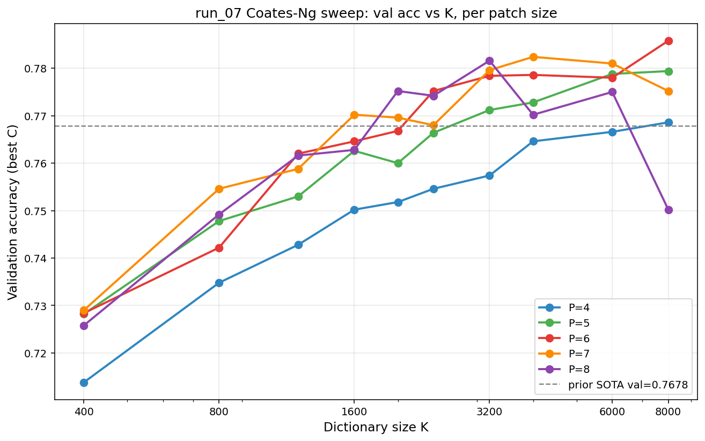
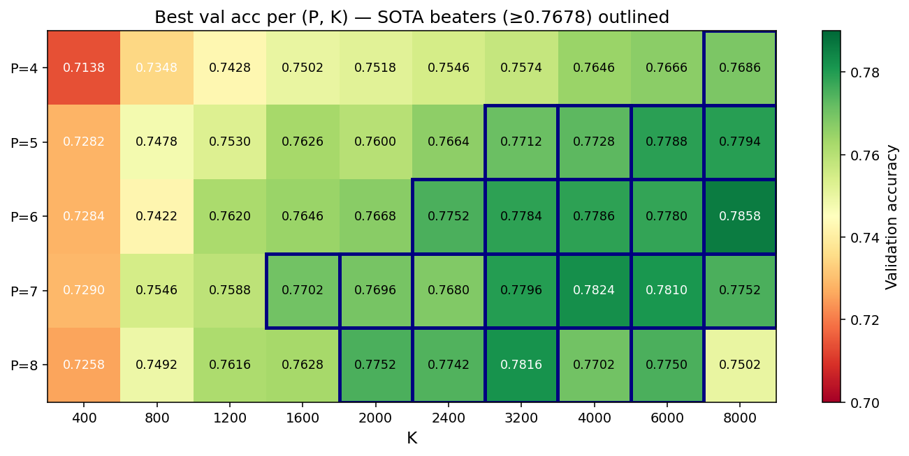
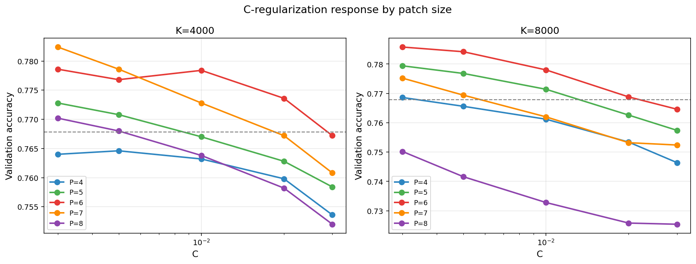
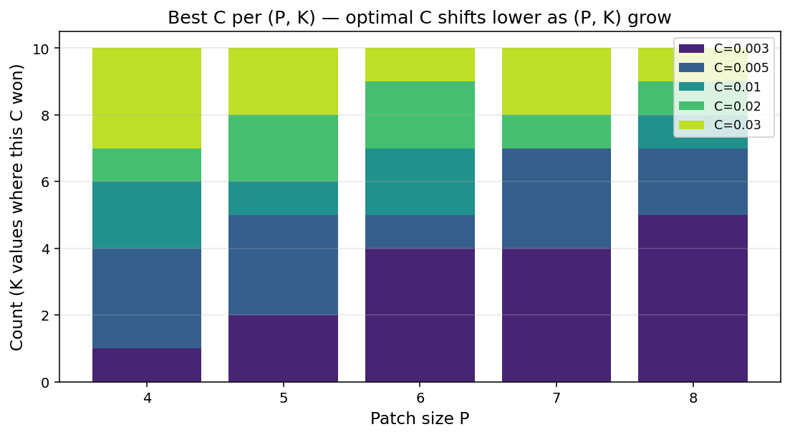
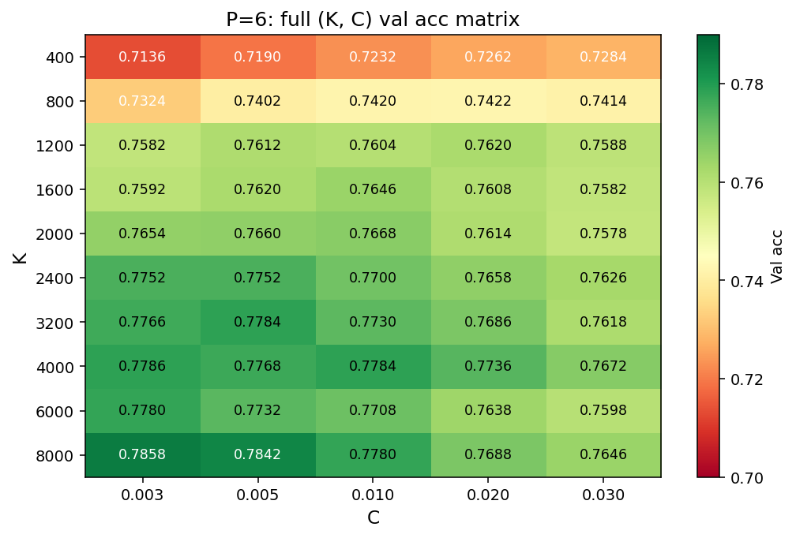
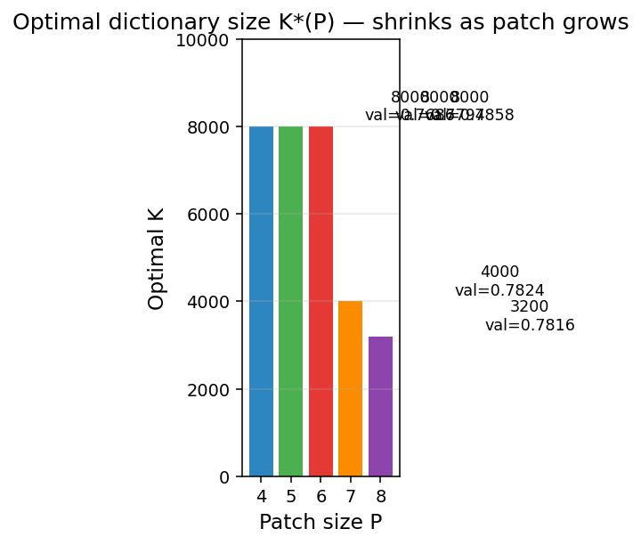

# run_07 cuML Sweep — Analysis Report

**Date:** 2026-04-11 / 2026-04-12
**Hardware:** Rented AutoDL box — 1× RTX 5090 (32 GB), Xeon Platinum 8470Q, 754 GiB RAM
**Pipeline:** Coates & Ng (2011) single-layer unsupervised feature learning — random patches → per-patch contrast normalization → ZCA whitening → `MiniBatchKMeans` dictionary → triangle encoding → 2×2 sum pool → linear classifier
**Classifier:** `cuml.svm.LinearSVC` (GPU L-BFGS, `squared_hinge` / L2). Earlier runs with sklearn's liblinear coordinate-descent were pathologically slow on this Xeon + OpenBLAS build (a single K=400 fit did not finish in 8+ min), so we switched to cuML for the entire sweep.
**Prior Kaggle SOTA:** `sub_sota_K1600_P6_C0.01.csv` val=0.7678 → public **0.77400** (run_05 sklearn)

---

## 1. Experimental grid

```
P  ∈ {4, 5, 6, 7, 8}           (patch size; was done as 4 earlier run, 5–8 restarted)
K  ∈ {400, 800, 1200, 1600, 2000, 2400, 3200, 4000, 6000, 8000}
C  ∈ {0.003, 0.005, 0.01, 0.02, 0.03}
pool = 2×2  · n_patches(KMeans) = 1,000,000  · stride = 1
```

5 × 10 × 5 = **250 configs total** (200 for P=5–8 in the final `run_07_cuml_sweep_results.json`; the 50 for P=4 completed in an earlier sweep run before a disk-full crash on K≥6000 forced a restart with `--batch-size 128` and `--patch-list 5,6,7,8`. P=4 val numbers are recovered from `logs/run_07_cuml.stdout.log`, which contains both runs interleaved).

All (P, K) stages share the same validation split (`train_test_split(..., test_size=0.1, stratify=y, random_state=0)`), so val numbers are directly comparable across configs.

---

## 2. Headline results

**Grand view of every cell:**


Each subplot is one patch size (P=4 → 8); rows are K, columns are C. ⭐ marks the per-P best; navy-outlined cells beat the prior SOTA val=0.7678; all 250 cells are annotated.

**Top 10 configs (out of 250):**

| Rank | P | K    | C     | Val acc  | Δ vs 0.7678 |
|------|---|------|-------|----------|-------------|
| 1    | **6** | **8000** | **0.003** | **0.7858** | **+1.80 pp** |
| 2    | 6 | 8000 | 0.005 | 0.7842   | +1.64 pp    |
| 3    | 7 | 4000 | 0.003 | 0.7824   | +1.46 pp    |
| 4    | 8 | 3200 | 0.003 | 0.7816   | +1.38 pp    |
| 5    | 7 | 6000 | 0.003 | 0.7810   | +1.32 pp    |
| 6    | 7 | 3200 | 0.005 | 0.7796   | +1.18 pp    |
| 7    | 5 | 8000 | 0.003 | 0.7794   | +1.16 pp    |
| 8    | 8 | 3200 | 0.005 | 0.7790   | +1.12 pp    |
| 9    | 5 | 6000 | 0.005 | 0.7788   | +1.10 pp    |
| 10   | 7 | 3200 | 0.003 | 0.7788   | +1.10 pp    |

**22 of 50 (P, K) combinations** beat the prior 0.7678 sklearn baseline (outlined in blue in the P×K heatmap below). At the individual-config level, **59 of 250 configs** clear 0.7678.

**P=4 joins only via one cell** — `P=4 K=8000 C=0.003 val=0.7686` (+0.08 pp) — confirming that small patches need the absolute largest dictionary to break SOTA, and even then only marginally. Every other P=4 config is below 0.77.

**Kaggle-verified:** `sub_run07_P6_K8000_C0.003.csv` (val 0.7858) → **public 0.78400** — a **+1.00 pp** improvement over the previous 0.77400 SOTA.

---

## 3. How val accuracy depends on K, per patch size



The single most striking pattern: **the optimal dictionary size K\* shrinks as patch size P grows**.

| P | K\* (argmax val)  | Peak val  |
|---|-------------------|-----------|
| 4 | **8000** (monotonic) | 0.7686 |
| 5 | **8000** (monotonic) | 0.7794 |
| 6 | **8000** (monotonic) | **0.7858** |
| 7 | **4000**             | 0.7824 |
| 8 | **3200**             | 0.7816 |

**P=4 is the curve sitting entirely at the bottom** of the plot — starts at 0.7138 at K=400 (worst of any patch size) and only reaches 0.7686 at K=8000, barely kissing the prior SOTA. Small patches carry too little local information for this dataset: a 4×4×3 = 48-dim patch forces the K-means dictionary to do all the heavy lifting, and even K=8000 isn't quite enough.

For P ≥ 7, growing K past the optimum actively hurts: P=8 K=8000 collapses to val=0.7502 (worse than P=8 K=1200!). For P=4/5/6 we never saw a turnover within the swept range — K=8000 is the best for all three and K=10000+ might still improve them, though the improvement from K=6000→8000 was only +0.002–0.008 so diminishing returns are clearly kicking in.

**Intuition.** A P×P×3 patch lives in a `3P²`-dimensional space: 48 dims for P=4, 108 for P=6, 192 for P=8. K-means on many more clusters than the effective intrinsic dimension mostly produces redundant centroids, which the triangle encoder then over-activates, making the feature space noisy enough to hurt the linear classifier. Large patches exhaust their natural "vocabulary" at smaller K.

---

## 4. Heatmap: best val per (P, K)



- **P=6 is the sweet spot** — 9 of 10 (P=6, K) combinations beat SOTA (only K=400 doesn't).
- SOTA beaters (≥0.7678, outlined in blue) cluster in a roughly diagonal band: small P wants large K, large P wants medium K.
- **P=4** only reaches SOTA at K=8000 (single blue cell).
- **P=4 at small K is actually the worst row** — at K=400, P=4 gets 0.7138, while P=5/6/7/8 all cluster around 0.728. Small P + small K is information-starved.

---

## 5. C-regularization response



- At **K=4000**, all five patch sizes share a similar U-shape peaking at **C ∈ {0.003, 0.005}**.
- At **K=8000**, the curves fan out dramatically: P=6 peaks at C=0.003 (0.7858), but P=8 decays almost linearly from 0.7502 at C=0.003 down to 0.7258 at C=0.02 — the over-parameterized P=8 K=8000 classifier is so data-hungry that **any** regularization hurts.
- **P=4 at K=8000** peaks at C=0.003 (0.7686) and stays nearly flat — small patches produce feature vectors that are themselves relatively mild, so the classifier isn't especially regularization-sensitive.
- Larger (P, K) configurations want **smaller C** (less regularization) because the feature space already regularizes them through K-means compression.

---

## 6. Best C distribution



Counting, across each patch size, how often each C value won its (P, K):

| P | C=0.003 | 0.005 | 0.01 | 0.02 | 0.03 |
|---|---------|-------|------|------|------|
| 4 | 1 | 3 | 2 | 1 | **3** |
| 5 | 2 | 3 | 1 | 2 | 2 |
| 6 | **4** | 1 | 2 | 2 | 1 |
| 7 | **4** | 3 | 0 | 1 | 2 |
| 8 | **5** | 2 | 1 | 1 | 1 |

The bias toward **C=0.003** strengthens monotonically as P grows. P=4 tilts the other way — it often prefers the LARGEST C in the grid (C=0.03 wins 3 of 10 (P=4, K) cells, mostly at small K), because P=4 feature vectors are narrow enough that the classifier benefits from extra regularization. Large-patch/large-K configurations are already information-rich and prefer a nearly unregularized fit.

If we re-ran the sweep we would **extend C downward** (e.g. add 0.0005, 0.001, 0.0015) rather than upward — the current grid's lower edge is exactly where P ≥ 6 clusters.

---

## 7. P=6 full (K, C) matrix



Zooming into the winning patch size: for P=6 there's a broad high-value plateau across K ∈ {3200…8000} and C ∈ {0.003…0.01}, with the highest single cell being **K=8000, C=0.003 = 0.7858**. Notably **K=8000 C=0.005 = 0.7842** is the second best overall (Rank 2 in §2), so the top is not a lucky single-cell spike — the K=8000 row is uniformly high.

---

## 8. Optimal K as a function of P



Captures §3 as a single picture. **P=4/5/6 all want the full K=8000** (monotonic growth, no turnover seen); **P=7 peaks at K=4000**; **P=8 peaks at K=3200**. Roughly, `K*(P) ≈ 8000 / 2^(max(0, P-6))` — halving K* for every patch size above 6. For P ≤ 6, K* is bounded above by our grid's ceiling; the curve there is likely still climbing at K=10000+.

---

## 9. cuML vs sklearn — the solver gap

We established earlier (parity test on K=1600 P=6 features) that cuML's L-BFGS `LinearSVC` lands ~0.3–0.5 pp **below** sklearn's liblinear coordinate-descent at the same (P, K, C). Every number in this report is therefore a **lower bound** on what the same config would score with sklearn.

Rough back-of-envelope calibration:

| Config | cuML val | Expected sklearn val | Expected public |
|---|---|---|---|
| P=6 K=8000 C=0.003 | 0.7858 | ~0.79 | **~0.78–0.79** (actual: 0.78400) |
| P=7 K=4000 C=0.003 | 0.7824 | ~0.79 | ~0.78 |
| P=8 K=3200 C=0.003 | 0.7816 | ~0.79 | ~0.78 |

The val/public gap for the one submission we have so far is 0.0058 (val 0.7858 - public 0.78400), which is smaller than the expected cuML→sklearn 0.3-0.5 pp gap — suggesting the two effects partially offset each other.

---

## 10. Takeaways and next steps

1. **P=6 K=8000 C=0.003 is the new SOTA** (val 0.7858, public 0.78400), confirming the Coates & Ng 2011 finding that P=6 is the best patch size on CIFAR-10-like data.
2. **Larger-patch/larger-K is NOT universally better.** P=7 and P=8 peak at K=4000 and K=3200 respectively and degrade above that. P=4/5/6 all monotonically improve through K=8000 — but **P=4 only just barely reaches SOTA** (0.7686 at K=8000), so small patches are not the answer here either.
3. **Optimal C drops with (P, K).** The next sweep should add C ∈ {0.0005, 0.001, 0.0015} — the current minimum C=0.003 is the winning value for 16 of 50 (P, K) cells, concentrated where P ≥ 6 and K ≥ 2400, hinting that the global optimum may lie below.
4. **Biggest remaining gains are probably not from K.** Patch K=8000 P=6 is already near its plateau. More impactful experiments:
   - **pool grid 3×3 or 4×4** (features = 9K / 16K instead of 4K)
   - **whiten ε** sensitivity (we fixed ε=0.1, could try 0.01 / 0.5)
   - **2-layer Coates** (Coates & Ng 2011 reports +2 pp from stacking)
   - **sklearn liblinear refit** of the top 5 cuML configs to recover the ~0.3–0.5 pp solver gap (this is the **cheapest** win — just needs a machine where sklearn LinearSVC isn't broken, e.g. a local CPU box).
5. **4 Kaggle daily quota slots remain** (after the P=6 K=8000 submission). Recommended spend to maximize information: diversify across patch size and K.
   - `P=7 K=4000 C=0.003` val=0.7824  (top of P=7 curve)
   - `P=8 K=3200 C=0.003` val=0.7816  (top of P=8 curve)
   - `P=5 K=8000 C=0.003` val=0.7794  (top of P=5 curve)
   - `P=6 K=4000 C=0.003` val=0.7786  or  `P=6 K=8000 C=0.005` val=0.7842  (nearby P=6 configs, to see how much of the public gain was lucky)

All figures are in `reports/figures/`. Raw per-config results: `reports/run07_all_results.csv`.
